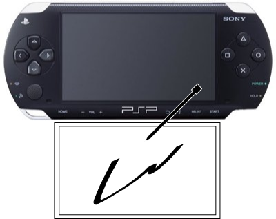

 문득 [이 글](http://www.smartgadget.kr/blog_post_65.aspx)을 보면서 이런 생각을 하게 되었다. PSP 에 터치스크린을 추가로 달면 어떨까? 앞의 링크를 따라가보면
 위와 같은 동영상을 볼 수 있다. NDS 에 일종의 마우스 기능을 붙인것이다. 무척이나 신성한 아이디어라고 생각한다. 하지만 나는 일단 PSP, NDS 둘다 곁에 있지만 PSP 에 좀더 관심(?)을 가지는 유저이므로 저 개념을 PSP 에 붙이면 어떨까 하는 생각을 해봤다. 나는 NDS 의 터치스크린도 무척이나 좋아하므로 둘을 합체 -\_-/

 IO  단자는 마치 GPS 모듈처럼 하고, 위치는 아래가 역시 좋다. 위에 있다고 생각해보면 touch screen 을 쓸 때 화면을 가리게 된다. 으음.. 닌텐도에 특허가 있으려나 ㅎㅎ PSP 의 고급 스펙에 터치스크린까지 있으면 정말 다양한 게임이 될텐데하는 생각이 든다. 뭐 가격이 항상 문제겠지만 ^^

