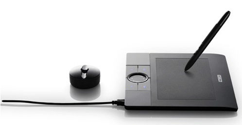
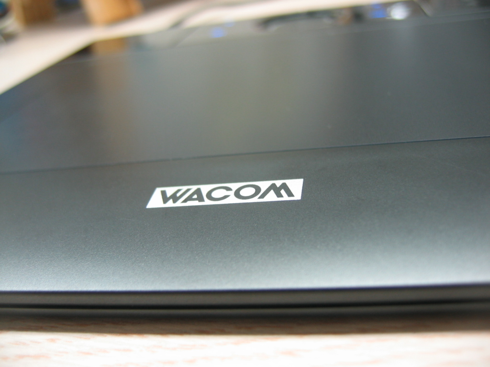
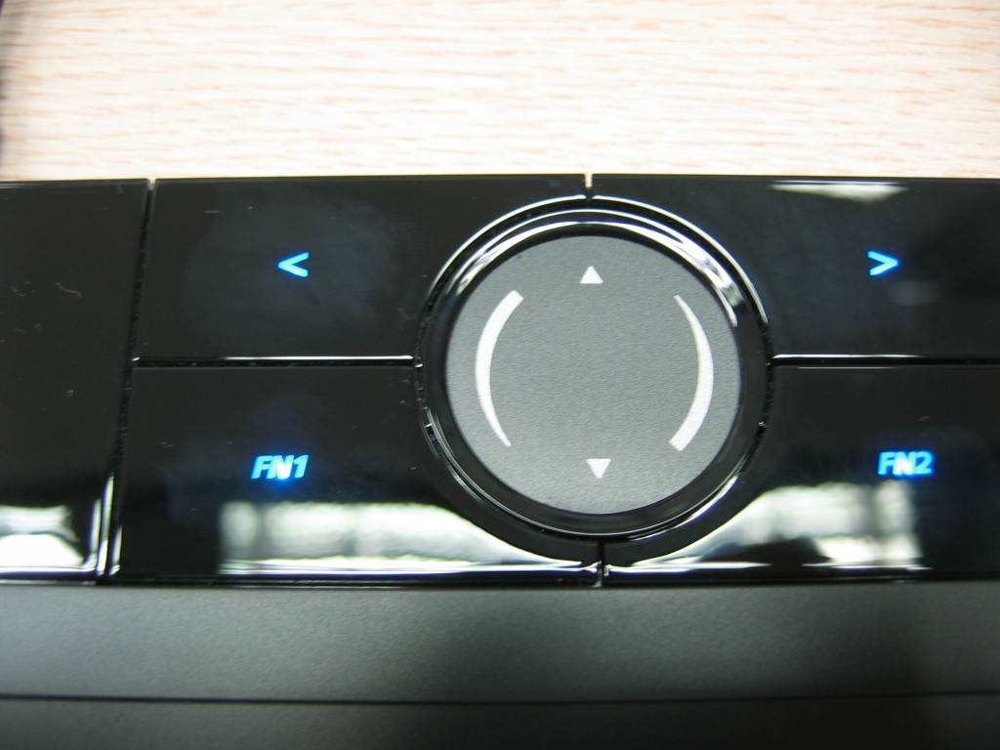
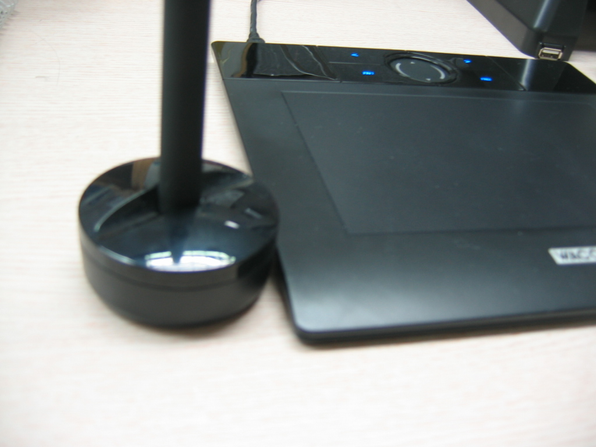

 방학 때 아르바이트를 해서 모은 돈으로 무엇을 하나 사고 싶다는 강렬한 생각과 왠지 컴퓨터 부품을 사고 싶다는 이상한 욕망에 못 이겨 결국 하나 질렀다.
 바로 '[뱀부](http://www.wacomdigital.co.kr/product/bamboo/bamboo_main.html)' 다. 와콤에서 나온 타블렛 중 가장 최신에 나온... 보급형이다;; 하지만 그 디자인과 일반인(!)이 쓰기에 불편이 없다는 글들을 보고 사버렸다.
 직접 만져본 후의 감상을 한마디로 요약하자면 '마우스 만큼 쓸 일은 없지만 충분한 매력을 느낄 수 있다' 이다. 특히 윈도우 프로그램 중 Painter 에서 몇개의 붓질만 해보면 그 감동이란.. ㅠ.ㅜ... 하.지.만. 리눅스에서는 그만큼의 감동은 느낄 수 없었다. [kldp.org 에 글](http://kldp.org/node/85619)을 올려보았지만 Krita 를 제외하고는 마땅한 응용 프로그램이 없는 듯 하다. 하지만 나에게 그나마 감성적인 그림을 그려보게하는 고상한(?) 취미를 줄 수는 있을 듯 하다. :)
 현재 우분투 리눅스 7.4 를 쓰고 있는데 여기에 기본으로 깔린 드라이버가 뱀부를 아직 지원하고 있지 않다. 그래서 <http://linuxwacom.sourceforge.net/> 에서 소스를 받아서 컴파일을 한 후, linuxwacom-0.7.8-3/src/2.6.19 에 있는 wacom.ko 파일을 /lib/modules/2.6.20-16-generic/kernel/drivers/usb/input 에 덮어씌웠다.
 그리고 /etc/X11/xorg.conf 파일을 백업해둔 후 열어서, Section "ServerLayout" 부분에 다음 4줄을 추가한다.

>     InputDevice    "stylus" "SendCoreEvents"
>     InputDevice    "eraser" "SendCoreEvents"
>     InputDevice    "cursor" "SendCoreEvents"
>     InputDevice    "pad" "SendCoreEvents"

 그런 후 아래에 위 4개에 해당하는 Section 을 적어준다.

> Section "InputDevice"
>     Driver            "wacom"
>     Identifier        "stylus"
>     Option            "Device"        "/dev/input/wacom"
>     Option            "Type"            "stylus"
>     Option            "USB"            "on"
> EndSection
> Section "InputDevice"
>     Driver            "wacom"
>     Identifier        "eraser"
>     Option            "Device"        "/dev/input/wacom"
>     Option            "Type"            "eraser"
>     Option            "USB"            "on"
> EndSection
> Section "InputDevice"
>     Driver            "wacom"
>     Identifier        "cursor"
>     Option            "Device"        "/dev/input/wacom"
>     Option            "Type"            "cursor"
>     Option            "USB"            "on"
> EndSection
> Section "InputDevice"
>     Driver            "wacom"
>     Identifier        "pad"
>     Option            "Device"        "/dev/input/wacom"
>     Option            "Type"            "pad"
>     Option            "USB"            "on"
> EndSection

 그런 후 컴퓨터를 리부팅하면 된다. 그런데 이상하게 한번씩 안 잡힐 때가 있는데 그 때는 Ctrl + Alt + Backspace 로 X 만 리셋... 음.. 이 문제는 앞으로 해결해야할듯... (아마 내가 해결보기 전에 커널 2.6.23 이 올라오면 자연히 해결될듯)
http://alexmac.cc/tablet-apps/
/lib/modules/2.6.20-16-generic/modules.dep
 마지막으로 스크린샷과 내가 그려본 내 싸인~

