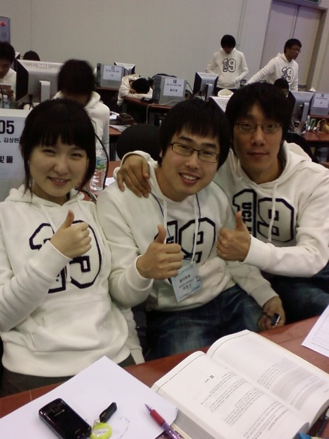
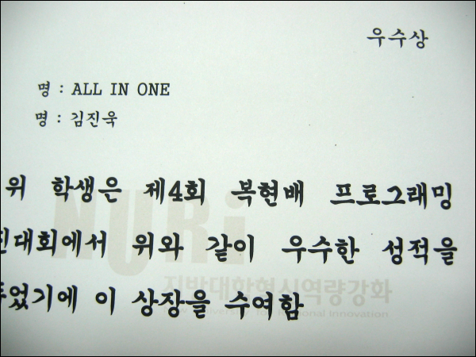

 2007년 11월 15일 복현배 프로그래밍 경진대회의 본선에 나갔다. 대회 중반까지는 거의 2등을 지키고 있었는데, 공교롭게도 중반 이 후 제대로 문제 해결을 하지 못하여 우수상(사실상 4등)에 그치고 말았다. 그래도 준비한 것에 비하면 좋은 결과가 나와서 꽤 만족을 하는 중 ^^;; 아, 그리고 보너스로 각 문제마다 제일 먼저 푼 팀에 도서 문화 상품권(5000원짜리 -\_-)를 줬는데 내가 푼 문제가 하나 걸려서 조금 더 만족 ㅎㅎ

 대회에 갈 때 내가 주로 쓰던 키보드를 하나 들고 갔던 것이 큰 도움이 되었던 것 같다. 대회에서 제공한 컴퓨터의 키보드가 Home, End, Page Up, Page Down 키가 세로로 일자로 붙어있는 키보드라서 정말 위험할 뻔 했다 -\_-

