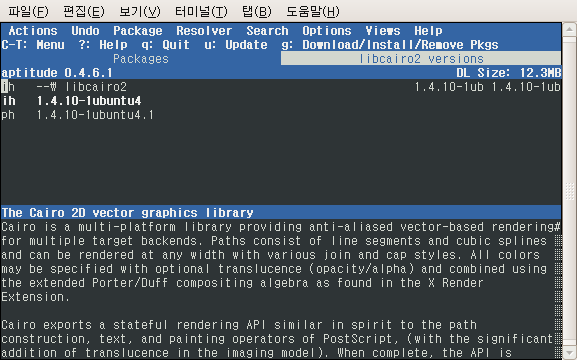

 최근 우분투에서 libcairo2 를 업데이트하면 X 가 제대로 뜨지 않는다던지, 3D 데스크탑을 쓰면 GUI 프로그램이 뜨자마자 죽는 현상(Floating Pointer Error 를 내며)이 있는 유저들이 있다.
 랜덤여신님의 글(<http://link.allblog.net/6855764/http://barosl.com/blog/entry/programs-based-on-cairo-crashes>) 에서 자세한 상황을 알 수 있고,
 ubuntu/Draco 의 글(<http://link.allblog.net/6845421/http://draco.aquz.biz/28>) 에서 시냅틱으로 해결방법도 알 수 있다.
 하지만 난 GUI 프로그램을 띄우면 바로 죽어버려서 난감해하고 있었는데, 신기하게도 Window + T 에 연결시켜뒀던 gnome-terminal 은 프로그램이 실행되었다. 실행되긴 했어도 창의 border 가 없이 말 그대로 text 만 있는 창이 떴다. 뭐 그래도 일단 콘솔 프로그램들이 실행되니 aptitude 로 이 상황을 해결해보기로 했다. ubuntu/Draco 의 글을 보면 libcairo2 의 버젼을 이전 버젼으로 돌리면 된다고 해서 관련 명령어를 찾아보니, 사용가능한 버젼을 보여주는 v 라는 단축키가 있었다.
 먼저 'sudo aptitude' 명령으로 aptitude 를 실행시킨다.
 / 를 누르고 libcairo2 를 찾아서, v 를 누르니 2개의 패키지가 보이고, 하나가 이전 버젼(1.4.10-1ubuntu4) 일 것입니다. 이전 버젼으로 가서 + 키를 눌러서 설치 선택후 g 를 눌러서 선택한 설치 실행. 이제 다시 리부팅하면 제대로 뜰 것입니다.
 임시로 libcairo2 의 버젼을 고정시키려면, aptitude 에서 libcairo2 를 찾은 후 = 키를 누르면 고정됩니다. 다음은 그 결과 화면입니다.

ps : 이 문제는 1.4.10-1ubuntu4.4 버젼에서 해결되었습니다 :)

