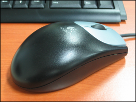

드디어 나도 문명의 혜택을 받을것인가... 캐논의 A80 이라는 카메라를 아는 사람으로부터 사게 되었다.
원래 수현이 결혼식전에 사서 찍어줄라 했는데 그 분이 좀 바쁘셔서 좀 늦게 받게 되었다. 조금은 아쉬움이~~
처음 사는 디카라서 디카를 잘 아는 분에게서 사게 되었는데 느낌은 꽤 만족~~ 보급형치고는 꽤 괜찮은것 같다. 적당히 작은 크기에, 메모리, 삼각대, UV 필터, 배터리 까지 풀셋으로 받았으니... 이리저리 써봐야겠다.
남들 한창 싸이한다고 디카살 때 멀뚱멀뚱 보기만 했었는데... 이제 다시 싸이를... 하지는 않을것 같고... 으음... 일단 이래저래 시간날 때마다 찍어봐야지 ^^/
ps : 요새 이래저래 많이 지르게 되는군 ㅋㅋ
ps2 : 사진은 전에 폰카로 찍었던 것을 이번엔 디카로!!

