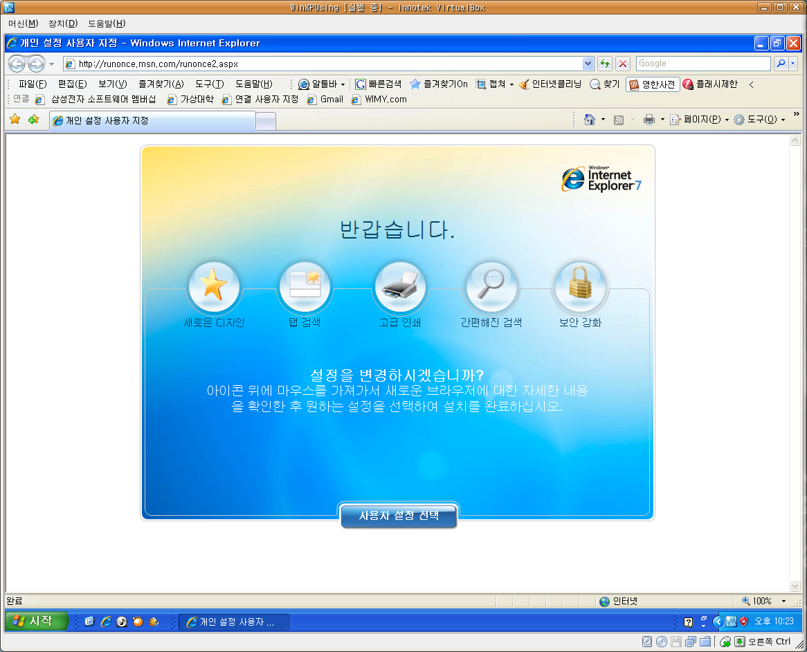

 오늘 VirtualBox 에서 돌리던 윈도우에 자동 업데이트 표시가 되어서 무슨 업데이트인가 싶어서 보니 Internet Explorer 7 로의 업데이트!! 드디어 버젼 7 로의 이행이 제대로 시작되려나...
 어쩔 수 없이 IE 를 써야할 때면 탭기능이 없어서 불편하고, 아직 7 을 제대로 지원하지 않는 사이트들도 많아서 6 을 쓰고 있었는데, 이렇게 자동업데이트로 7 을 배포하기 시작하면 아무래도 판세는 7 로 갈 것 같다. 통계를 지켜봐야 겠지만 대세는 대세가 될 것이다.
 참고로 파이어폭스의 마우스 제스쳐 기능이 이스트 소프트에서 알툴바라는 프로그램을 통해서 제공되므로(아직 All-in-one gesture 만큼의 세밀한 기능은 없지만) 제법 기본적인 동작이 가능하므로 꽤 편하게 탭 브라우징을 할 수 있다.
 이제 내 홈페이지 테스트도 7 과 파이어폭스만 해도 되겠지? ^^

