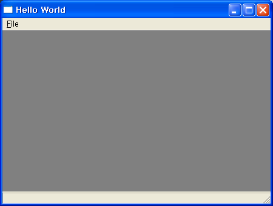

http://www.wimy.com/wiki/wiki.php/wxwidget
에 MinGW, wxWidget 를 기반으로 eclipse 에서 간단한 샘플 파일을 컴파일하는 방법을 작성 중이다.
 wxWidget 은 플랫폼(OS) 에 상관없이 GUI 를 구현하기 위한 라이브러리로써 사실 GUI 가 기본이나 OS 의 API 에 종속적인 여러 부분들을 wrapping 해준다.

