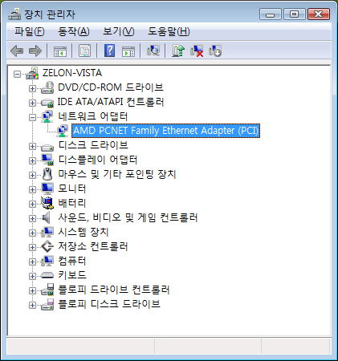

 이제 슬슬 비스타를 경험할 때도 되었다는 생각에 VirtualBox 에 Vista 를 설치해보았다. 설치는 문제 없었는데 XP 때와 다르게 네트워크 드라이버를 제대로 잡지 못하는 것 같았다.
 VirtualBox 의 Guest Addon 도 설치해보았는데 제대로 잡지 못해서 이래저래 검색을 해보니, Guest Addon 을 설치하면 CD-ROM 에 Guest Addon 을 위한 ISO 가 마운트되게 되는데 여기의 AMD\_PCnet 이라는 폴더 안에 네트워크 드라이버가 있다는 것이었다.
 그래서 장치 관리자에서 해당 폴더의 드라이버를 설치해주니 네트워크(NAT로 설정)가 동작되었다.

