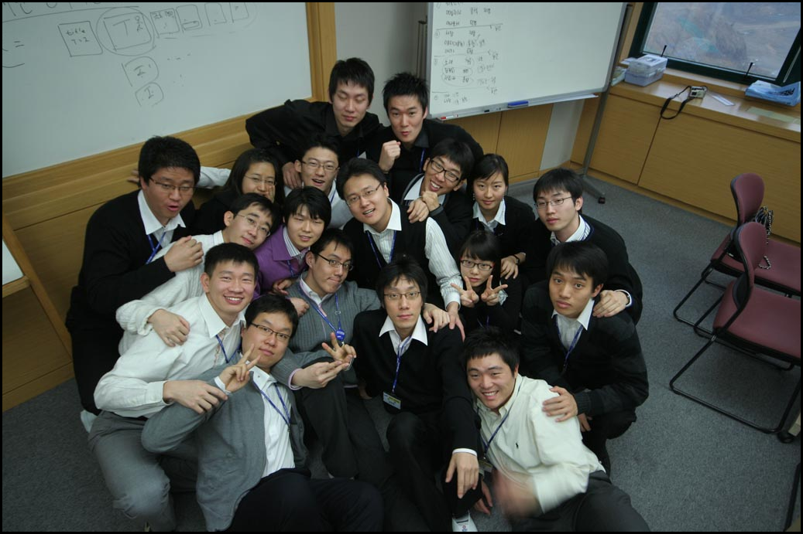

 지도 선배님께서 말씀하신 '결혼하는 데 1년이 걸렸는데 실제로 만난 시간을 따져보니 500시간쯤이었다. 근데 너희들과 같이 보낸 시간이 그쯤되더라' 라는 말처럼, 우리 48기 9차 동기들은 20여일간 하루에 3~4시간씩 자면서 나머지 시간을 같이 보냈다. 21시간 \* 20일 하면 420시간이다. 이 시간동안 같이 보낸 동기들, 사랑에 빠지지 않을 수 없을 것이다.
 건설, 네트웍, 전자, 에버랜드... 회사는 다르지만 앞으로 다시 만날 것을 약속하며 2008년 1월 25일 그 첫 생일을 함께했다. 지금 그 느낌을 잊지 않으리...

