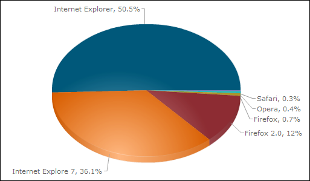

 http://barosl.com/blog/648
 랜덤여신님의 글(<http://barosl.com/blog/648>) 에서 IE7 이 IE6 의 통계를 앞질렀다는 글을 보았다.
 <http://www.wimy.com/tt/133> 의 글에서 IE7 의 자동업데이트를 알 수 있었는데, 역시나 모든 컴퓨터에서 동시가 아니라 특정 순위에 따라서 점차적으로 진행되었다. 처음에는 한꺼번에 되리라 생각했지만, 멤버십의 내 가상머신의 윈도우 -&gt; 멤버십 컴퓨터 -&gt; 집(김천)의 컴퓨터 2대 -&gt; 내 노트북(아직 자동 업데이트 목록에 뜨지 않음) 이런 순서로 진행되고 있다. 나 혼자 쓰는 컴퓨터들도 이렇게 순서가 생길 정도로 천천히 진행되고 있는 것 같다.
 재미삼아 내 사이트(wimy.com)의 통계를 체크해보았다.

 위 자료는 <http://inside.daum.net> 에서 얻은 내 홈페이지 방문자들의 통계이다. 하루에 200여명 들어오는 자료이미로 큰 신빙성은 없지만 확실히 IE7 의 점유율이 눈에 띄인다. 하지만 아직 내 홈페이지 통계에서는 IE7 이 IE6 보다는 15% 정도 점유율이 떨어진다. 하지만 역시 자동 업데이트가 무섭긴 무섭다.
 난 홈페이지 작업을 많이하는 웹프로그래머는 아니지만, 탈도 많고 말도 많던 IE6 가 드디어 서서히 사라지기 시작한 것이라서 다행이라는 생각도 든다. 개인적인 생각으로야 firefox 한 개의 웹브라우저만 지원하면 좋겠지만 그래도 남들이 내 사이트를 이상해진 레이아웃으로 보고 있다는 생각을 하면 테스트 해보지 않을 수 없다. 이런 내 고민처럼 웹페이지 제작자들이 신경쓰고 있겠지?

