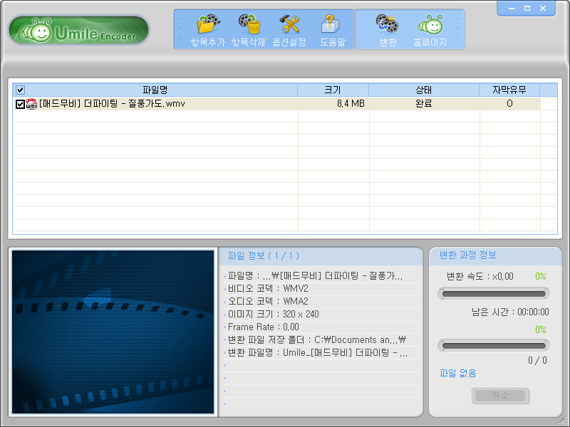

 PSP 용 동영상 변환기는 사실 곰인코더가 제일 좋은 것 같다. 하지만 유료이며, 무료로 사용하려면 모든 기능은 유료와 같지만 변환된 동영상에 곰인코더 로고가 큼지막하게 10분정도 영상 위에 출력되는 버젼을 사용해야한다. 그래서 열심히 인터넷을 뒤져본 결과 XviD4PSP, PSP Video 9, 엔젤인코더 등을 사용해보았는데 사용법이 꽤 복잡하거나, 자막이 안 입혀지거나, 다되었는데 이상하게도 내 PSP 에서 동영상 플레이가 되지 않거나했다.
 그래서 곰인코더 유료 결제를 하려고 12개월 - 1만 2천원까지 클릭했다가, '아~~ 차라리 내가 만들까.. -\_-' 하는 생각을 하게 되었고, 갑자기 'psp 동영상 변환 개발' 이라는 키워드로 검색을 시작했다. 그런데 유마일이라는 변환기가 검색되었다. 재수~~
 거의 곰인코더와 비슷한 인터페이스를 가지고 있으며, 곰인코더보다는 세세한 설정이 아직은 불가능하다. 제일 눈에 띄게 다른건 CPU 점유율 우선순위를 설정할 수 없다는 것이다. 뭐 크~게 불편한 점은 아니고, 무료로 쓰는 주제에 많은 것을 따지지 않는다. 현재 버젼은 1.5.4 버젼.
 아래와 같은 화면에서 변환이 시작되며, 변환 위치를 미리보기 창에서 보여주지 않으며, PSP 용 썸네일 파일을 만들어주지 않는다. 자막은 잘 적용되며, PSP 에서 플레이도 잘 되었다.

 홈페이지는 <http://www.umile.kr/> 인데, <http://cafe.naver.com/umile> 로 포워딩된다. 벌써 꽤 많은 유저들이 사용중이며 대부분 곰인코더에서 넘어온 유저들 같다. 2007년 10월에 처음 릴리즈가 되었으며, 현재 공식적으로는 심파일에서 다운받을 수 있는데, 심파일 로그인을 해야하므로, firefox 에서도 다운이 잘되는 [앳파일](http://atfile.com/search.html?ser_gu=&ser_pv_name=%C0%AF%B8%B6%C0%CF&x=0&y=0)에서 다운받을 수 있다.

