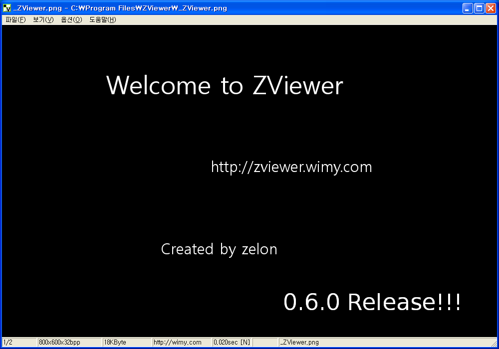

 릴리즈 노트에도 적었지만 너무 오랜 기간동안 릴리즈를 못해서 스스로 반성하기 위해서라도 일단 0.6.0 버젼을 릴리즈합니다. 자주자주 기능을 업데이트하고 꾸준히 발전시켜야하는데 그러지 못해서 아쉽네요. ZViewer 한테 신경 많이 써줘야겠습니다. :)
 [\[ZViewer 0.6.0 다운로드\]](http://kldp.net/frs/download.php/4536/ZViewerSetup0.6.0.exe)
 변경된 점은 다음과 같습니다.
 \* v0.6.0(2008. 2. 20)
  \* freeimage library 3.10.0 로 업데이트
  \* jpeg2000 지원(jp2, j2k)
  \* 마지막 그림 파일에서 Next 했을 때 처음 그림 파일, 그 반대로의 동작도 옵션으로 설정가능(즉, 그림 보기가 순환 - loop 됨)
  \* 내부적으로 유니코드 지원
  \* 다른 드라이브의 폴더로 파일이 이동되지 않던 버그 수정
  \* ZViewerAgent 에서 다른 형태의 파일로 저장하기
  \* ZViewerAgent 의 메뉴도 국제화 - 기존의 한글화되지 않았던 것 수정
  \* 환경설정 파일 추가. 몇몇 옵션을 파일로 저장하고 불러오는 기능 추가.
  \* Enter 혹은 F 키를 눌러도 FullScreen 동작하게 변경(기존의 Alt+Enter 도 여전히 동작함)
 조엘온소프트웨어를 읽고 내부적으로 유니코드를 지원하자라는 생각에 작업을 시작하고, 괜히 윈도우, 리눅스 둘다 돌아가게 하면서 UI library 를 테스트하느라 너무 엄청난 시간이 걸려버렸네요. 일단은 유니코드를 지원하게까지는 되어서 절반의 성공이라 생각합니다.
 ZViewer 의 핵심 이미지 라이브러리인 freeimage 가 업데이트되어서 jpeg2000 을 지원할 수 있게 되어서 괜히 뿌듯합니다. ^^;
 보통 다른 이미지 뷰어 프로그램들이 마지막 장에서 '다음장' 을 하면 처음 파일로 돌아가서 해당 기능을 추가했습니다.
 이제 드디어 ZViewer 의 설정 파일을 만들고, 유저가 설정한 설정을 저장하게 되었습니다. 내부적으로는 많이 테스트했습니다만 아직 제가 만족할만한 코드의 깔끔함이 더 필요할 듯 합니다. 설정 파일은 XP 기준으로 C:\\Documents and Settings\\USERID\\Local Settings\\Application Data 에 저장됩니다. Vista 에서는 아쉽게 테스트를 못했습니다만, 이론상(!)으로는 잘 동작하리라 생각합니다. - 환경되시는 분 테스트 부탁드립니다;;
 딱히 변경을 안 하던 ZViewerAgent 가 유니코드 관련으로 업데이트되면서 작은 기능이 추가되었습니다. 탐색기에서 그림 파일에 대고 오른쪽 버튼을 눌렀을 때 '다른 이름으로 저장...' 메뉴가 추가되어서 바로 이미지 파일의 형식을 변경할 수 있습니다.(예. jpg -&gt; png)
 많은 리눅스 프로그램들이 Full Screen 으로 갈 때 'F' 키를 쓰길래 간단히 추가했습니다. :p
ps : <http://zviewer.wimy.com> 페이지를 만들었습니다. :)

