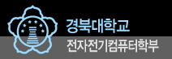

 졸업하기 전에 쓰고 싶었던 글인데 졸업하고 나서 이제서야 쓴다;;
 사실 나는 학교나 정부 시스템에 큰 기대를 안 하고 살아왔다. 컴퓨터학과의 홈페이지라고 Web 2.0 기술이 적용되거나 시대의 흐름에 맞춘 서비스를 제공하거나 그러지 않는다. 그냥 일반 학부생이 관리하거나, 조금 더 웹을 다룰줄 아는 대학원생이 관리하거나, 그나마 웹에 취미가 있는 학생이 관리하거나, 외주업체가 관리(진짜 관리다. 업데이트가 아니다.)하거나 등이다.
 하지만 작년 여름에 나는 그만 흐뭇(?)하게 웃음을 지을 수 있었다. 우리 학과에 RSS 가 있던 것이다. 사실 그전에 내가 학과 게시판에 관심이 없어서 언제부터 서비스되었던지는 모르겠지만, 학과의 가장 중요한 게시판에 달려있엇다.
 '아... 학교도 나름대로 발전하고 있구나...' 하는 생각이 들었다. 어떻게 생각하면 웃긴다. 당연히 발전해야하는 학교가 '발전' 했다고 좋아하다니...
 이제는 학교를 떠났지만, 그래도 아직 남은 후배들, 그리고 앞으로 들어올 후배들이 더욱 발전시키고, 남아계시는 교수님분들과 학교 행정 관계자분들이 더욱 발전시켜 주시면 좋겠다.
 마지막으로 경북대학교 전전컴의 RSS 주소는 http://eecs.knu.ac.kr/edu02/rss/notice\_rss.jsp 이다. 참고로 http://eecs.knu.ac.kr 에서 RSS 버튼을 누르면... firefox 에서는 제대로 복사되지 않는다;;
 여튼 경북대학교 전자전기컴퓨터학부 파이팅 ^^/

