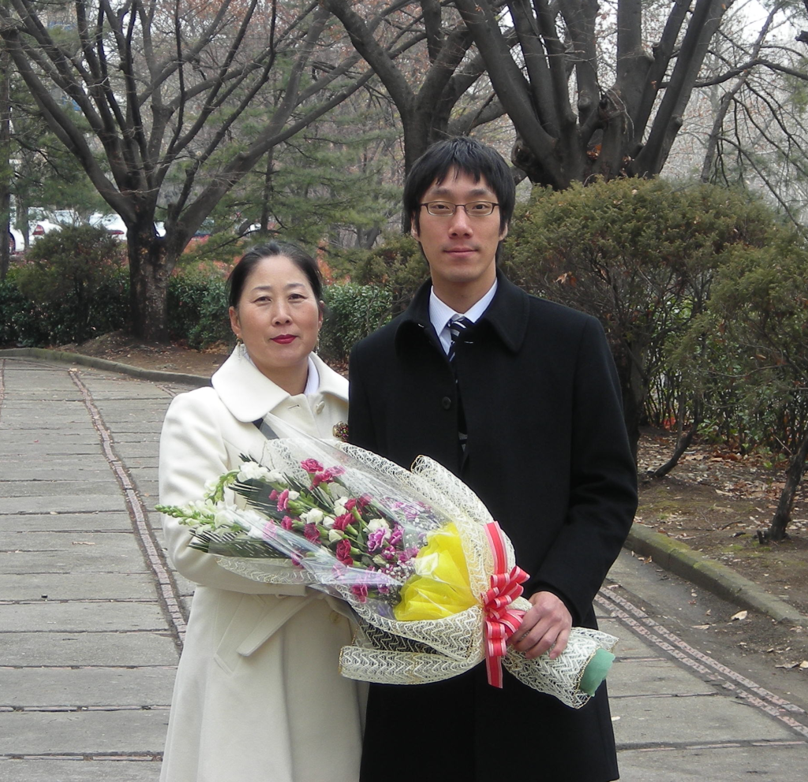
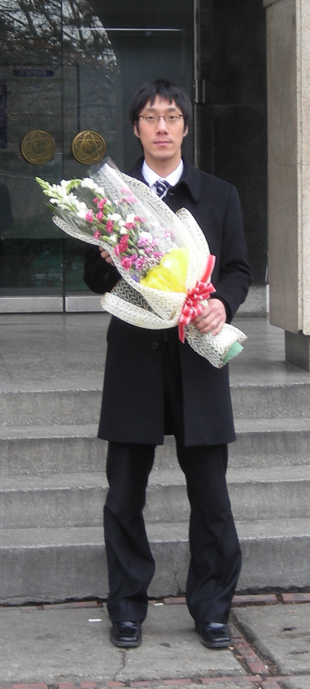
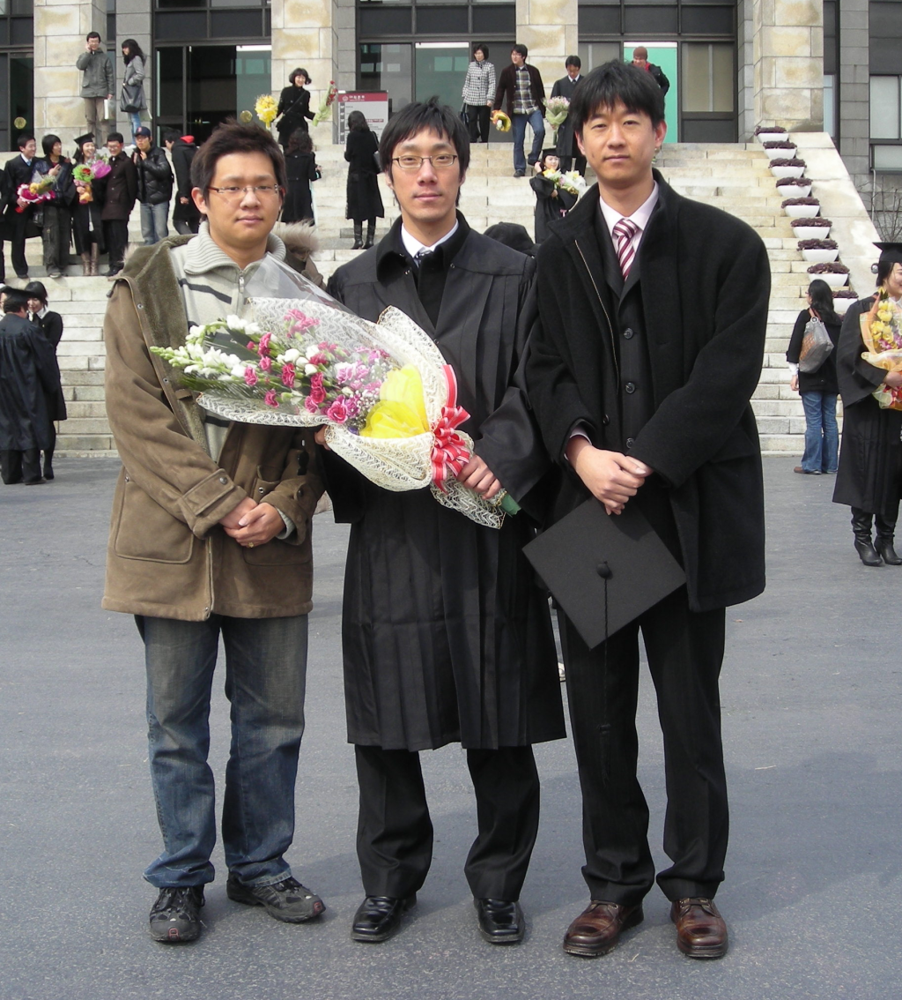
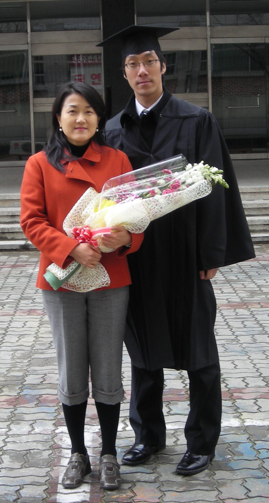
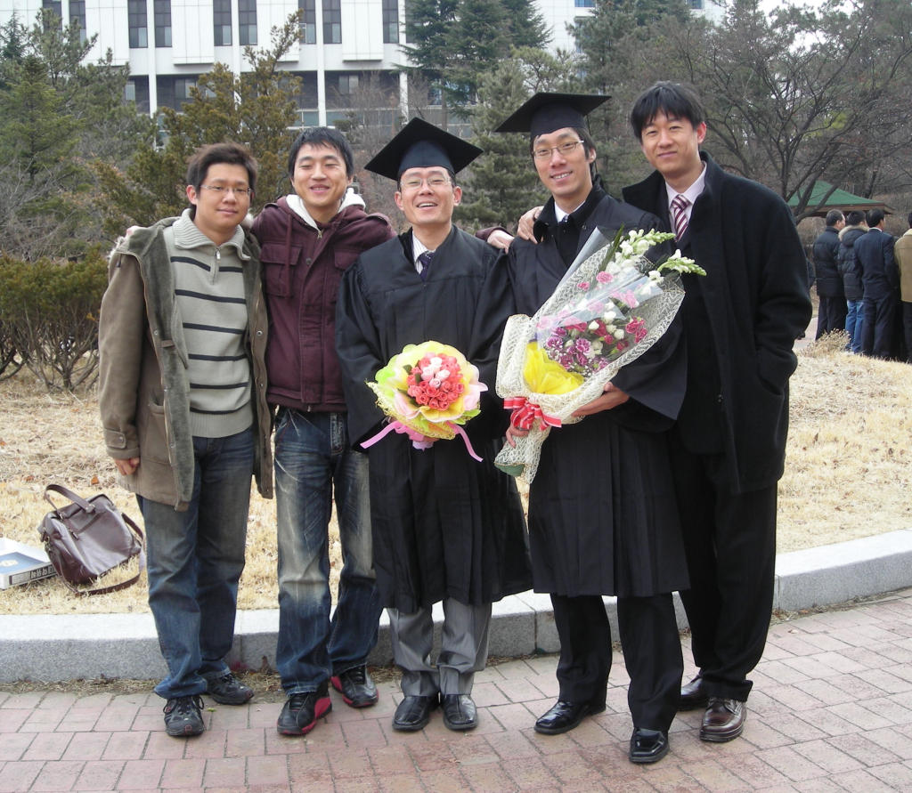

 드디어 졸업을 했다. 대학생의 신분으로 있은지 약 10년이다. 1999년도에 입학해서 2008년에 졸업식을 했다. 난 남들보다 가방끈이 긴거겠지? ^^;;
 대학교에서 정말 하고 싶었던 컴퓨터를 했고, 정말 좋은 친구들을 만났다. 미친듯이 공부를 하기도 했었고, 미친듯이 몇달간 게임을 한적도 있었다. 학과 생활을 정말 열심히 했었고, MT 를 정말 많이 갔었다. 학과 부학생회장을 했었고, 소모임 회장도 했었다. 몸짓도 재미있었고, 전전컴을 느꼈을 때 정말 새로웠다.
 Meteor, Air, Kert, 그리고 멤버십...... 함께 했던 소중한 곳들......

ps : 난 이제 고졸이 아니다!

