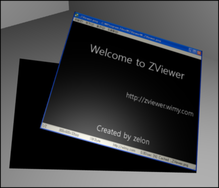

 이런저런 ZViewer 관련 글을 읽다가 <http://nashimaryo.tistory.com/834> 에서 '항상 위' 기능을 필요로 하는 분이 있다는 것을 알고, 간단할 거 같아서 추가했다. 역시 기능 추가하는데는 실제적으로 2줄이나 메뉴 만들고, 체크 표시하고 그런게 더 걸린 거 같다.
 그리고 800x600 에서 ZViewer 를 실행하면 창의 위치가 엉뚱한 곳에 가서 윈도우의 메뉴도 안보여서 무척이나 난감한 상황이 발생한다는 글이 있어서 수정했다. 간단히 현재 화면 해상도의 80% 의 가로, 세로 길이를 가지게 해서 해결했다.
 회사일도 바쁘고, 정신도 없지만 이렇게라도 조금씩 해서 감을 잃지 않아야 겠다고 다시 다짐하는 하루다.
ps : 기능 추가된 버젼을 배포한 것이 아니고 작업을 했다는 겁니다. 0.7.0 버젼이 배포되면 기능을 쓰실 수 있습니다. :)

