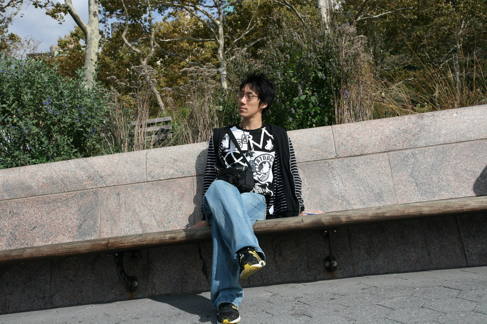

 이제서야 작년 10월에 대한 글을 쓸 짬이 난 건지 일단 포스팅을 시작해본다.
 멤버십에서 만나 가장 친한 친구 중 가장 가깝게(!) 지낸 친구인 태윤이랑 같이 보낸 일주일... 그리고 생전 처음간 외국여행...
 영어 실력이라고는 MSDN 을 읽어봤다는 정도와 대만에서 3일정도 대만사람과 영어로 업무 잠깐 해본 적 밖에 없던 내가 미국의 뉴욕이라는 곳에 가게 되었었다. 이런저런 사건이 있었지만, 내가 캐나다의 친구도 겸사겸사 보려는 생각에 유럽보다 미국을 택하게 되었고, 미국이라면 '뉴욕' 이라는 생각에 뉴욕으로 떠났다.
 태윤이의 풍부한 외국여행 경험(!)으로 가기전 이런저런 조사를 많이 했었고, 우린 정말 빡빡한 일정을 가지고 뉴욕을 둘러보았다. 우리가 흔히 생각하는 뉴욕은 사실 뉴욕의 '맨하탄' 이라는 곳인데 일주일동안 여기의 유명한 곳중 엠파이어 스테이트 빌딩을 빼고는 다 둘러보았다.(정말 태윤이는 대단하다) 아침 7시 좀 넘어서 일어나서 오후 10시에 돌아오는 매일이 일정~~ 정말 후회없는 여행이었다.
 참고로 다른 분들에게 하고 싶은말은,
- 여행책자의 내용 중 상당한 내용은 오래된 내용이다. 특히 노선도는 많이 바뀌고. 그러므로 책의 인쇄 날짜를 한번쯤 확인할 것.
- 미국 맨하탄에 트럭 멋진게 정말 많다. 트랜스포머의 그런 트럭... 길가에 널렸다. 캐나다 친구 말로는 돈있는 사람이 트럭 타고 다닌다던데 -\_- 승차감도 꽤 좋단다.
- 미국 흑인 정말 친절하다. 백인보다 더 친절한 듯. 물론 모든 흑인, 백인이 그런건 아니지만 날 밀치고 지나간 백인이 있었고, 나에게 친절하게 길을 먼저 갈켜준(내가 지도 보면서 갸우뚱하고 있으니까) 흑인 아주머니가 있었다.
- 버스에서 노약자에게 자리를 양보하는건 미국인들도 잘~~~ 한다. '노약자에게 자리를 양보합시다' 라는 글이 미국 버스에도 적혀있다.
- 뉴욕의 맨하탄 지하철 더럽고 안 좋다는 책자가 많았는데 그렇지 않다. 우리나라의 지하철처럼 1호선, 2호선 같은게 있는데, 옛날에 지어진 노선은 좀 그런곳도 있지만, 최근 지하철 노선은 우리나라 어떤 지하철보다 더 좋다. 여튼 한 정거장은 정말 내리면 위험해보이는 곳(페인트칠이 벗겨지고 철근이 녹슨)이 한군데 있었지만 99%의 지하철 정거장은 책자에서 말하는 만큼 나쁘지는 않았다.
 마지막으로 사진들~~~

