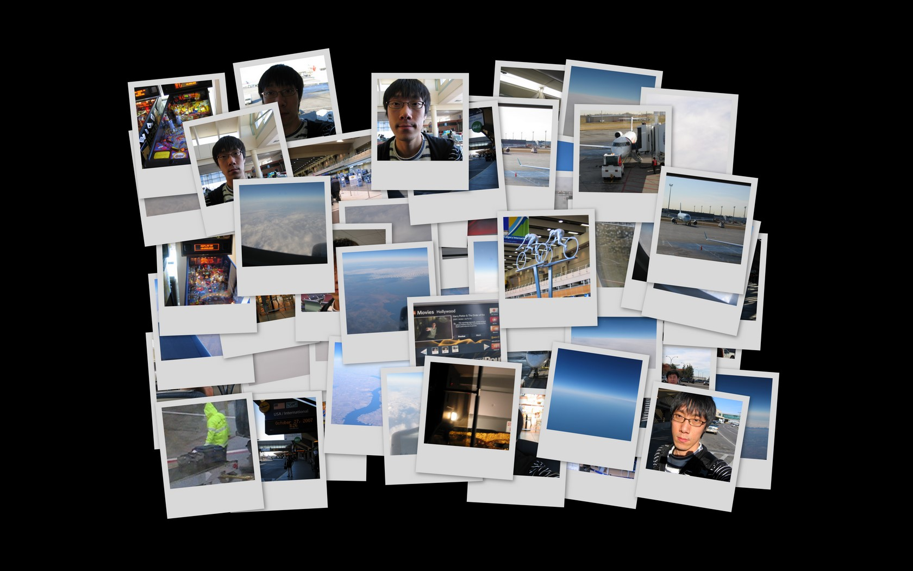
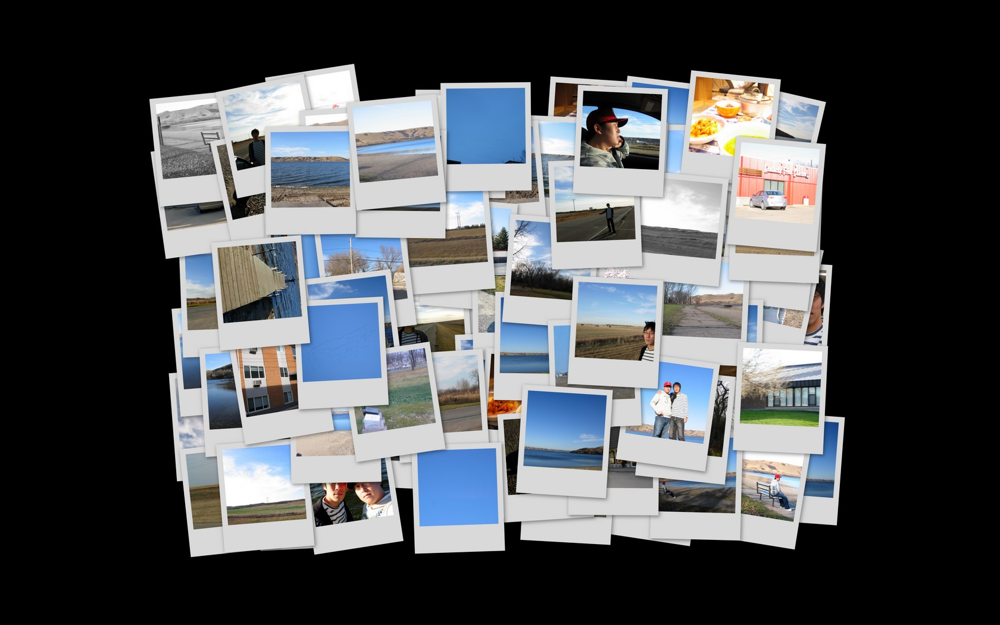
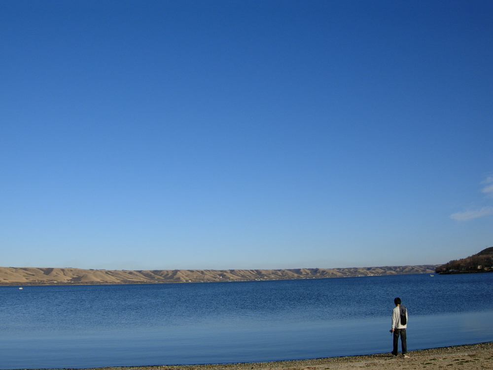
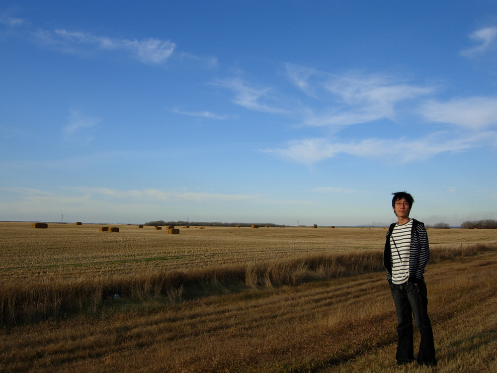
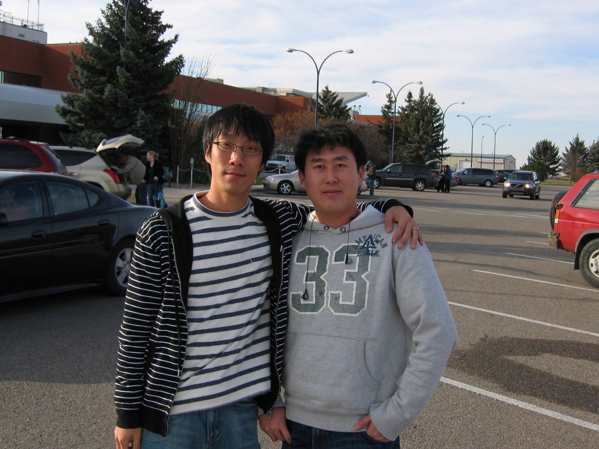
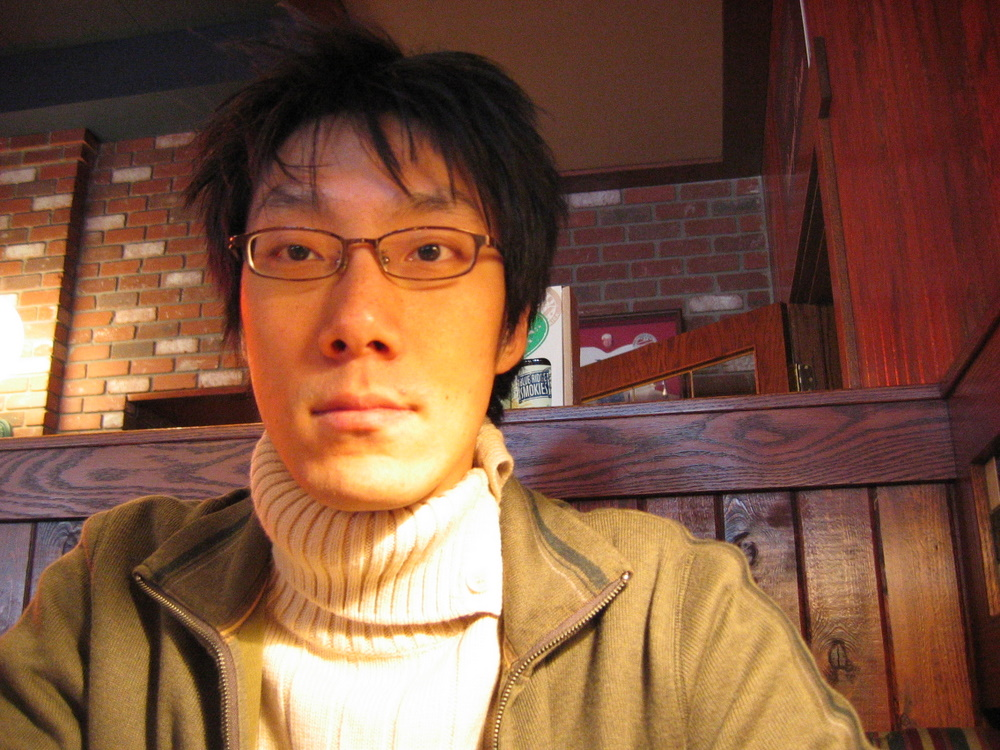
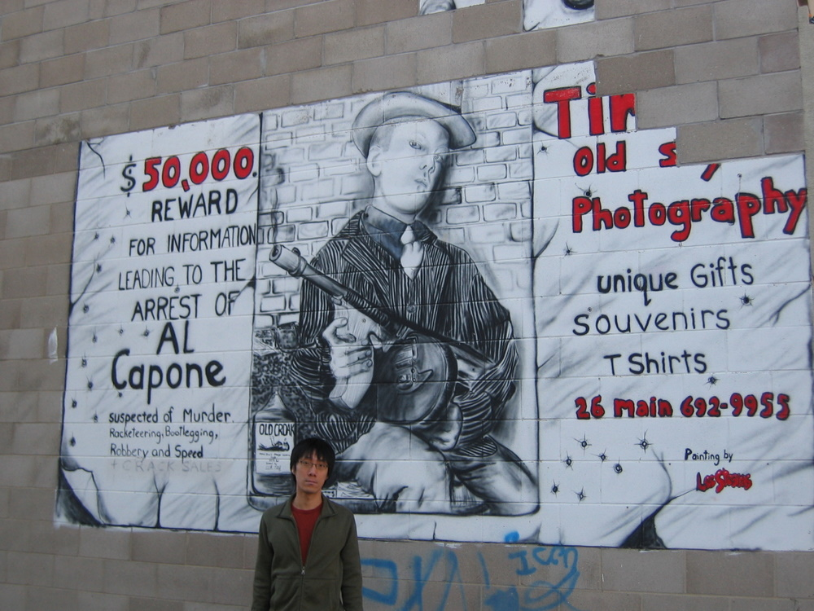
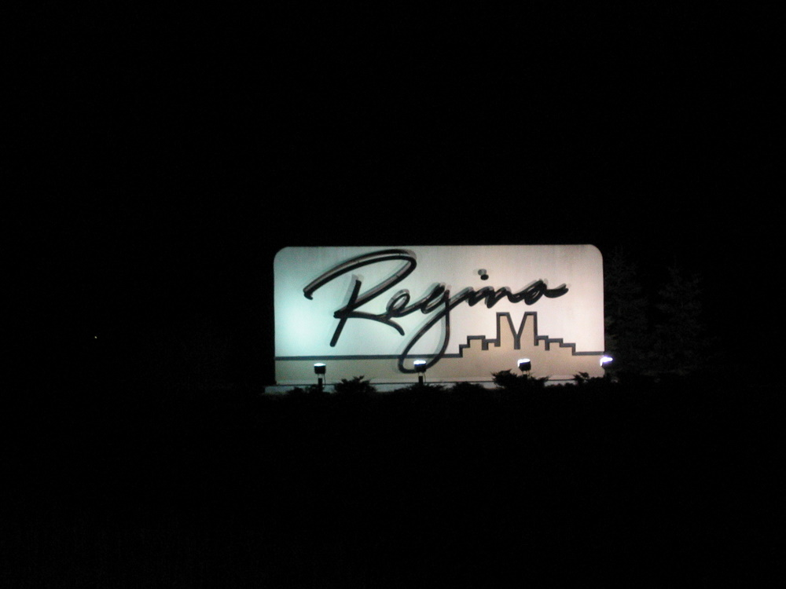
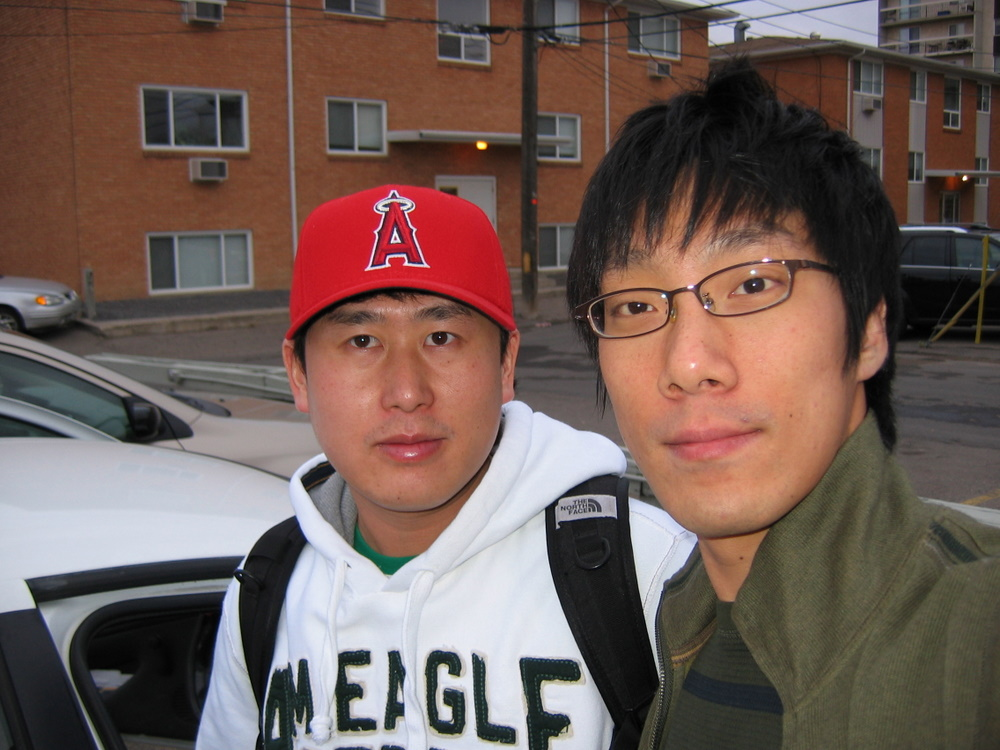

 나의 영원한 친구(자주보지는 못한다-\_-)인 세훈이가 살고 있는 캐나다의 리자이나에 일주일 정도 머물렀었다. 태윤이와 함께 미국의 맨하탄에 갔다가 일주일 후 태윤이는 한국으로 오고 난 홀로 캐나다의 리자이나에 갔다.
 혼자 비행기를 타보는 건 처음이었기에 무척 무서웠고 -\_- 게다가 처음으로 비행기 갈아타기 코스가 포함된 코스여서 더 무서웠다 -\_-/ 하지만 콩글리쉬로 물어물어서 다행히 잘 도착했다. 중간에 입국절차 받을 때 힘들었지만 그럭저럭 통과~
 캐나다는.... 생각만큼은 춥지는 않았다. 친구 말로는 10월되면 얼음이 얼어야 정상인데 이상기온으로 내가 왔을 때는 얼음도 얼지 않았다고 한다.
 일주일간 맨하탄에서 빡시게 여행다녀서 캐나다의 리자이나에서는 좀 여유롭게 다녔다. 영어를 매우 잘하는 친구 세훈이가 있어서 더 멋진 곳을 가고 싶었지만 친구가 학교를 다니는 관계로 너무 넓은 캐다다에서 둘러보지는 못했다. 다만 근처의 도시인 '무스자'라는 곳에 가서 [지하세계](http://www.thefamilytravelfiles.com/ezine/articles/500.asp)를 탐험했다. 일종의 지하 공장이었는데, 불법 입국자들을 막노동 시키는 곳이었다.
 세훈이의 3가지 '잊지 않을 일' 도 포함해서 정말 재미있었고, 정말 '친구'는 몇 년만에 봐도 어제 본 것처럼 느껴진다는 것을 느낄 수 있었다.

