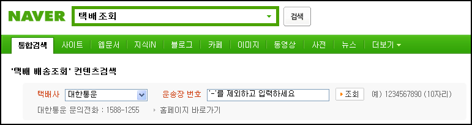
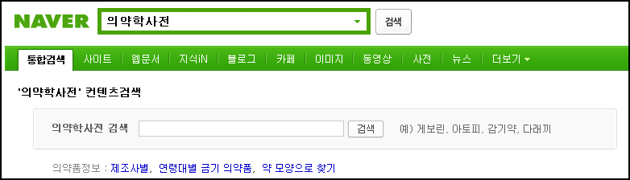

네이버는 사실 닫힌 검색으로 열린 검색과 오픈소스, 오픈된 인터넷등을 지지하는 많은 분들에게 비판을 받고 있는 분위기이다. 하지만 역시 우리나라 1위의 포털사이트라는 사실은 변함이 없고, 아마 그것은 많은 대중의 사랑을 받는 엄연한 실질적인 유용한 사이트이기 때문이다.
 [네이버의 검색 공식 블로그 RSS](http://blog.rss.naver.com/naver_search.xml) 를 보면서 재미있는 기능들을 보면 역시 한국형 포털이라는 생각을 하게 된다. 많은 분들이 구글의 다양한 기능들을 보면서 대단하고 재미있다는 생각을 하지만 역시 네이버는 1위를 할 만하다는 생각을 한다. 간단히 원하는 것을 치면 잘 나온다는 것은 역시 무척이나 편리하다.
 '택배조회' 라고 치면 각 회사별로 운송장번호를 입력하면 다음과 같이 택배조회를 바로 할 수 있게 해준다.

 위와 비슷하게 '영문주소' 라고 치면 한글로 된 집 주소를 영문 주소(즉 영어로)로 바꿔주는데 외국에 물건을 받거나 보내거나, 외국 사이트에 가입을 할 때 유용하게 쓸 수 있다.
 그리고 '드라마' 라고 치면 현재 방영중인 드라마 목록을 보여주고, '편성표' 를 치면 방송사별 편성표를 볼 수 있다.
 마지막으로 '의약학사전' 라고 치면 다양한 약들을 검색할 수 있는데, 재미있는 것은 알약의 모양과 문양, 색깔 등으로 어떤 효과를 가지는 약인지 검색할 수 있다는 것이다. 요즘 약 봉지에 보면 약의 이름등이 적혀있는데 여기서 검색해보면 어떤 약을 내가 처방 받았는지 알 수 있다.

 분명 네이버는 컴퓨터를 잘 모르는 사람에게 유용한 정보를 제공하는 편리한 사이트이다.

