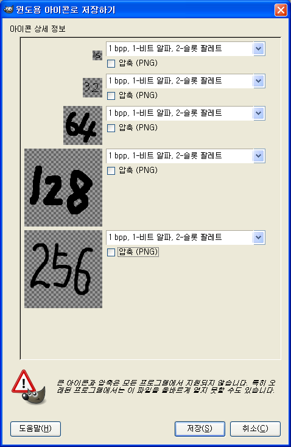

ZViewer 를 개발하면서 가장 힘든 부분이 바로 아이콘 만드는 부분이다. 나의 미적 감각이 부족한게 가장 큰 이유이고, 디자이너를 섭외해도 복잡한 Visual Studio 에서 작업을 하거나, 다른 상용툴을 써야한다. 현재는 Visual Studio 를 쓰고 있지만 이것도 상용툴이라서 바꾸고 싶은 상황이고, 분명 어딘가에는 아이콘을 편집하는 좋은 툴이 있겠지라는 생각에 자꾸 찾고만 있었는데, 바로 옆에 있었다 -\_- GIMP 에서 꽤 훌륭한 아이콘 편집을 지원해준다.
 난 당연히 GIMP 가 GNU 툴이라서 윈도우에 대한 지원이 미흡할거라고 생각하고 있었는데, 우연히 ZViewer 로 열리지 않는 아이콘 파일이 있어서 혹시나하고 GIMP 에 던져줬더니 너무 잘 읽었다. 그래서 내가 만드는 것도 잘되는가 해서 보이는 대로 해보았더니 잘된다 ㅠ.ㅜ
 핵심은 여러개의 레이어를 만들고, 레이어마다 크기를 다르게 해서 저장하면, 레이어 하나가 해당 해상도를 가지는 아이콘이 되는 것이다.

 예를 들어 레이어1은 16x16 으로 해서 그리고, 레이어2는 32x32 로 해서 그 파일을 .ico 로 저장하게 되면 '윈도우용 아이콘으로 저장하기' 창이 뜨면서 꽤 다양한 옵션을 선택해서 아이콘 파일을 만들 수 있게 해준다.
 ZViewer 아이콘 디자인 섭외를 한 적은 오래되었는데 이제 제대로 작업할 수 있을듯하다. :) 다음 버젼에는 깔끔한 아이콘으로 다시 태어날 듯 ^^
 

