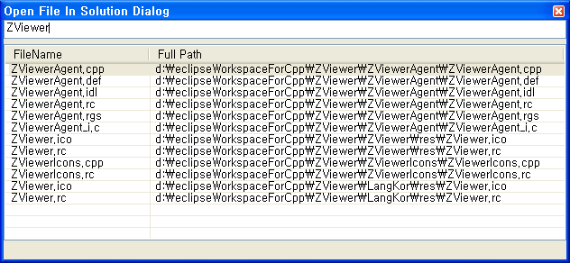

 회사 과제를 할 때나 ZViewer 을 개발하던 중 Visual Assist 를 안 쓰니까 너무 불편함을 느껴서 예전부터 해보고 싶었던 일을 저질렀다. Visual Assist 기능 중 내가 자주 쓰는 기능만 모아서 간단하게 만들어보자는 것이다.
 내가 주로 쓰는 기능은 다음과 같다.
\* .h, .cpp 간의 빠른 전환
\* 프로젝트의 파일을 이름 몇 글자만 쳐서 빠르게 옮겨가기
\* 현재 파일 내의 함수를 함수 이름만 쳐서 빠르게 옮겨가기
\* 코딩 중 Ctrl + Space 안 치고도 assist 기능
 그리고 내가 종종 만들어 쓰는
\* 현재 작업 중인 솔루션 폴더를 탐색기로 열기
 기능을 추가하려고 시작했다. 이름은 기존처럼 Z 를 붙여서 ZAssist 로 하고 프로젝트는 아직은 조금 부족해보이지만 구글 코드(http://code.google.com/)에서 하기로 했다. 당연히 코드는 공개된다. 여튼 그래서
<http://zassist.googlecode.com>

를 만들었다. 그리고 간단히 작업해서 다음 기능을 일단 완성했다.
\* .h, .cpp 간의 빠른 전환
\* 프로젝트의 파일을 이름 몇 글자만 쳐서 빠르게 옮겨가기
\* 현재 파일 내의 함수를 함수 이름만 쳐서 빠르게 옮겨가기
\* 현재 작업 중인 솔루션 폴더를 탐색기로 열기
그리고  <http://www.wimy.com/wiki/wiki.php/ZAssist> 에 위키 페이지 추가.

 근데 문제는 아직 Visual Studio Add-in 기능에 익숙하지 않아서, 설치, 배포 등을 어떻게 해야할지 모른다는 것이다. 무척 난감하다. 내가 짠 프로그램을 디버깅할 때는 Visual Studio 에서 잘 돌아가는데 다른 프로그램을 짤 때는 내가 만든 add-in 이 자동으로 뜨지 않는다. 실컷 짰는데 내가 이용은 못하고 있으니... 으음..... 좋지 않다. -\_-;;;;;;;;

