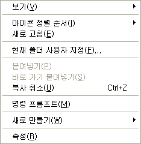

 리눅스와의 호환성을 강화하기 위해 기본 압축 프로그램을 빵집에서 7-zip 으로 바꾸어쓰기 시작했는데, 빵집의 cmd 창 열기 기능이 너무 아쉬웠다. 사실 일반 데스크탑 사용자들은 별 쓸 일이 없지만 프로그래머는 개발 중에 종종 cmd 창을 원하는 폴더에서 여는 일이 필요한데 cmd 창 열고 경로를 일일이 copy & paste 하려니 너무 귀찮았다.
 그래서 2년 넘게 손대지 않았던 ZViewer 의 쉘 확장 기능인 ZViewerAgent 에 메뉴를 추가하기로 결정. 2년 넘게(아마 4년으로 짐작된다) 보지 않았던 쉘 확장 관련 부분을 보니까 완전 새로 공부하는 기분이었다. 함수 반환값과 인자 값이 뭐였는지도 모르겠고, 코드도 난잡하게 짜놓았었고, 여튼 좋지 않았다. 새로 공부하기를 이틀간하니까 왠만큼 코딩은 되었는데 이상하게 내 생각대로 동작되지 않는 것이었다. 그래서 땜빵으로 일단 작동하게만 해서 완료 -\_-;;
 간단한 기능 테스트는 잘되는데 너무 고생한 것에 비해 얻은 것은 딸랑 cmd 창 기능. 그것도 일반 사용자들은 잘 쓰지도 않는 기능. 뭐 다시 쉘 확장 관련 공부했으니까 공부한 셈 쳐야겠다.
 아... 이거 만들다가 불편해서 [ZAssist](http://www.wimy.com/wiki/wiki.php/ZAssist) 만들었으니 그나마 위안은 된다 ㅋㅋ

