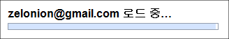

 이전에는 로딩 중... 이렇게 되어있다가 진행되었는데, 이제는 다음과 같은 조금은 더 친절하고 예쁜 화면을 보여준다. 구글의 깔끔함을 보여준다.

 정말 간단한(?) 변화인데도 유저를 배려했다는 생각이 든다. 재미있는 점은 gmail 은 저 화면에서 로딩에 시간이 걸리면 '인터넷이 느리면 간단한 화면으로 전환' 과 비슷한 문구를 보여주고, 해당 링크를 누르면 CSS 를 로딩하지 않는 화면으로 넘어가서 '인터넷 속도가 느린 환경을 위한 배려' 를 해주고 있다.
 요즘 UX 니 뭐니 하면서 사용자에 대한 배려가 상당한 이슈가 되고 있는데, 나도 유저를 배려할 수 있는 프로그램을 짜도록 노력해야겠다는 생각을 다시 해본다. 하지만 대체 작업은 언제하지? ㅋㅋ

