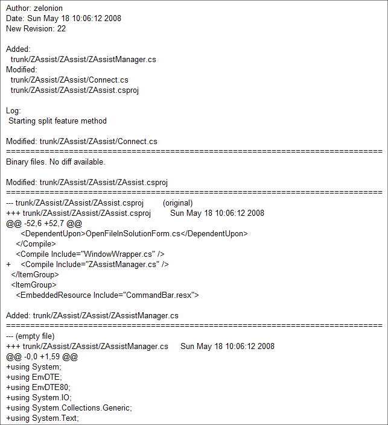

 구글에서 [sourceforge](http://sf.net) 와 비슷한 오픈소스 프로젝트 호스팅을 한다는 건 이전에도 알고 있었지만, 막 런칭된 후에 테스트로 잠깐 만져본 것 이후로는 별 관심이 없었다.
 그런데 최근에 [ZAssist](http://www.wimy.com/wiki/wiki.php/ZAssist) 를 만들어보면서 괜히 구글에 대한 호감(내가 gmail, igoogle, google search, 캘린더, reader, office 를 쓰고 있어서) 때문에 한번 [구글 코드 호스팅](http://code.google.com/hosting/)을 써보기로 하고 진행해 보았다.
 오늘에서야 알았지만, 소스에 커밋(commit)이 발생하거나, 새로운 issue 가 등록될 때 특정 메일 주소로 메일을 발송하는 기능이 있다는 것을 알았다. 1인 프로젝트에는 큰 의미가 없을 수 있으나 여러명이서 진행을 하면 꽤 유용할 거라는 생각이 든다. 실제로 테스트를 해보면 diff 내용까지 보여주면서 꽤 괜찮은 메일을 보여준다.

 그리고 source 를 웹에서 살펴볼 때 WinMerge 만큼의 [예쁜 화면으로 diff 를 표시](http://code.google.com/p/zassist/source/diff?r=22&format=side&path=/trunk/ZAssist/ZAssist/Connect.cs)해준다.(한 줄의 코드가 길어서 가로 스크롤바를 움직여야 제대로 보이긴 하지만 ;; )
 꽤 만족스럽다~ :) 앞으로도 혹시 다른 프로젝트를 진행하게 되면 구글 코드 호스팅을 이용하게 될 거 같다.

