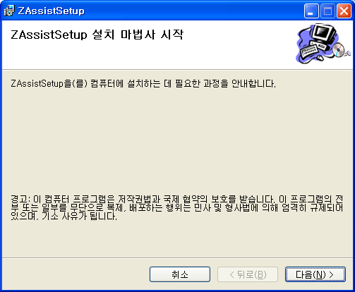

 오늘 회사에서 너무나 늦게 마치는 바람에 괜히 자기전에 뭐라도 하고 자야지 하는 생각에 당장 할 일이 눈에 보이는 ZAssist 를 손에 잡았다. 생각해보니 전에 교육 중 과제 빨리하고 쉬는 시간에 검색만 해둔 url 이 있어서 참고를 했더니 꽤 쉽게 설치 파일을 만들어 낼 수 있었다.
 핵심은 "내 문서\\Visual Studio 2005\\Addins" 폴더에 .Addin 이라는 xml 파일을 넣는 것과, Add-in DLL 파일을 복사해 넣는 것. 이렇게 달랑 2개였다(해당 사실을 명확히 해준 홍채군에게도 감사를~).
 일단 워낙 오랜만에 Visual Studio 의 인스톨러를 만들어서(예~~~전 ZViewer 의 C\# 버젼 - 아마 2001년도로 기억 - 만들때 만들어보고 제대로 해보긴 처음일듯) 가물가물했으나 워낙 쉬운 툴이므로 대충대충 매뉴얼 따라서 만들었다. 그리고 잠깐 테스트 해보니 일단 만족~ 언인스톨도 잘되고, 2005 부터는 레지스트리가 아니라 폴더에 파일이 있고 없고도 Add-in 의 존재유무를 판단하기 때문에 레지스트리 찌꺼기의 걱정도 없다(하지만 인스톨러가 프로그램 추가/제거를 위한 것은 있을것이라 생각한다).
 그래서 결국 다음과 같은 프로그램을 얻을 수 있었다.

 아직 릴리즈 버젼을 결정해야하고(일단 1.0 부터 시작할까 싶음), 아이콘을 제대로 넣어야 하고, 가능하면, '현재 파일에서의 함수들을 빠르게 찾아가기' 기능까지는 넣고 릴리즈를 하고 싶다. 언제가 될지는 모르겠지만, 내일이 될 수도 있다 -\_- ㅋㅋ
 아... 그리고 오랜만에 Add-in 관련 검색을 하다보니 잊고 있었던 [Kingstool](http://www.codeproject.com/KB/macros/kingstools.aspx) 이 생각나서 검색해보니 아직 업데이트가 없다. 처음 이 소스가 오픈된 Add-in 을 보면서 Add-in 을 만들어볼까 생각했었는데 이미 잊고 있었다니 -\_-;; 지금보니 꽤 괜찮은 기능들이 많은데 시간될 때마다 하나씩 코드를 참고하며 ZAssist 에 넣어봐야 겠다.

