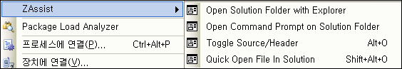

 아이콘도 넣고 원하던 기능도 하나 더 넣고 싶었으나, 구글 코드에도 적혀있는 오픈소스의 "Release early, release often" 에 따라 얼른(!) 릴리즈를 해본다. 아무래도 한번 릴리즈하고 나면
이런저런 얘기도 들리고, 미처 생각도 못한 재미있는 것들이 생길 것이라 생각한다.
 ZAssist 는 Microsoft Visual Studio .NET 2005용 Add-in 으로서 다음과 같은 기능을 가지고 있다.
- 현재 열린 솔루션 파일이 있는 폴더를 탐색기로 열기
- 현재 열린 솔루션 파일이 있는 폴더를 명령창(cmd.exe)로 열기
- 같은 이름의 소스/헤더 파일 전환(.cpp &lt;--&gt; .h)
- 솔루션의 파일을 빠르게 찾아가기
 현재 위의 4가지 기능을 제공하며, 도구 -&gt; 옵션 -&gt; 환경 -&gt; 키보드 에서 ZAssist 로 검색해서 원하는 키보드 단축키를 할당하면 더욱 쉽게 쓸 수 있다.
 현재 .NET 2005 에서만 테스트되었으며, 소스는 <http://code.google.com/p/zassist/> 에서 찾을 수 있다. 라이센스는 GPL 이며, 회사, 개인등 마음대로 사용할 수 있다.
 [ZAssist 다운받기 - from Google Code](http://zassist.googlecode.com/files/ZAssistSetup1_0.msi)
 ZViewer 를 처음 릴리즈할 때가 생각난다. 누군가는 쓸거야라는 생각을 하며 릴리즈를 했지만 생각보다 반응은 전~~혀 없었고 재미도 없었지만, 조금씩 누군가 쓴다는 얘기가 들리고, 책에서 소개가 되는 무척이나 기쁜 소식을 들을 수 있었다. ZAssist 도 그 뒤를 이어가면 좋겠지만 개발자 전용 프로그램이라 더욱 기대는 하지 않는다. 다만, 2005 를 쓰는 개발자 중 누군가에게라도 도움이 되었으면 좋겠다 :)

