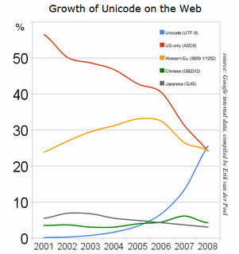

 지난 2008년 5월 5일에 포스팅된 글이지만 이제 봤습니다. <http://googleblog.blogspot.com/2008/05/moving-to-unicode-51.html> 의 그래프를 보면 2007년 12월에 드디어(!) UTF-8 방식의 인코딩을 따르는 웹 페이지가 ASCII 방식의 인코딩을 따르는 웹페이지를 따라잡았다고 합니다. 구글의 조사이므로 상당한 신빙성이 있다고 보여집니다.

 재미있게도 [제 홈페이지의 인코딩 방식을 바꾼 시기](http://www.wimy.com/tt/120)와 비슷하네요. 사실 여기에 대한 제 개인적인 견해로는 리눅스 배포판들이 대부분 utf-8 방식을 기본으로 바꾼 것이 상당한 역할을 했다고 생각합니다. 그리고 유명한 서비스들이 글로벌한 서비스를 시작하면서 아무래도 유니코드를 제대로 지원하게 되면서 utf-8 로 왔을 겁니다. 국내의 경우에는 티스트리, 이글루스등의 사이트가 상당히 utf-8 의 견인차 역할을 했을 것 같습니다.
 혹시 이 글을 보고 있는 당신이 프로그래머라면 당신은 유니코드로 프로그램을 짜고 있습니까? ASCII 와 유니코드의 제일 큰 차이점을 알고 계십니까? 만약 그렇지 않다면, 조금은 시간을 들여서 꼭 훑어보시기 바랍니다. 표준을 외우라는 것이 아니라, 마치 tcp 와 udp 의 차이를 아는 것처럼 ASCII 와 유니코드의 차이를 아셔야합니다. 유니코드의 가장 큰 장점은 하나의 문서에서 한국어와 독일어, 아랍어를 동시에 표현할 수 있다는 겁니다. 이런 경우를 경험하셨을 겁니다. 한국어로 된 문서가 아닌데 깨어진 한글 - 떀뽀줸챕뎌 처럼 - 로 표현되는 것은 ASCII 방식으로 다른 codepage 로 인코딩된 것을 한글 인코딩(흔히 euc-kr 이라고 하죠)로 표현해서 그렇습니다. 그래서 결국 한 언어를 쓰게 되면 그 페이지에서는 다른 언어를 쓸 수가 없게 됩니다. 유니코드는 이런 오류(?)가 없습니다. 하나의 페이지에서 여러 언어들을 쓸 수 있는 거죠.
 다른 예를 들자면, 한국인과 일본인이 서로의 언어 공부를 위해 메일을 주고 받을 때, 두 명 모두 각자의 언어로 쓴다고 가정합시다. 한국인은 한글로 쓰고, 일본분은 일본어로 씁니다. 답변을 달 때는 상대방의 언어를 인용해서 쓴다고 할 경우, ASCII 방식을 쓰면 어떻게 될까요? 한국어 인코딩을 할 때는 일본어 부분이 깨어지고, 일본어 인코딩을 할 때는 한국어 부분이 깨어지겠죠. 이럴 경우, 세계의 모든 문자를 다른 숫자로 매칭시켜놓은(!) 유니코드를 쓰면 같이 쓸 수 있습니다~
 이제 유니코드 프로그래밍은 기본 교양입니다. 유니코드로 프로그래밍하고, 이력서에 '국제적인 감각을 지닌 프로그래머' 라고 한 줄 더 적읍시다 ^^/
 유니코드에 대한 이해의 시작으로, 전 [조엘온소프트웨어](http://kangcom.com/common/bookinfo/bookinfo.asp?sku=200503170001)라는 책을 권하고 싶네요. 이 책으로 유니코드에 대한 감을 제대로 잡았다는 분들을 몇 분 만났었습니다. 저도 그렇구요.(사실 저도 감만 가지고, 개인 프로젝트만 유니코드로 겨우 하고 있습니다 ㅎㅎ)
 [네이버 뉴스에서 utf-8 로 검색](http://news.naver.com/search/search.naver?rcsection=&query=utf-8)을 해보면 세계화를 지향하는 업체들이 utf-8 로 바꿨다는 기사들을 볼 수 있습니다. 하지만 아이러니하게도 우리나라의 상당수의 대형 업체들은 아직까지도 euc-kr 을 사용하고 있는 상황이니다. 아쉽게도 현재 국내 1위 포털인 네이버도 euc-kr 을 사용하고 있습니다. Daum 도 아직 euc-kr 이군요. Active-X 문제도 그렇지만, 우리나라의 웹 페이지 수준이 세계적인 추세에 따라가지 못하는 것 같아서 더욱 아쉽습니다.
ps : 재미있는 것은 살짝 세간의 관심을 끌고 있는 구글의 안드로이드에 내장된 웹브라우져는 인코딩이 utf-8 일 때만 제대로 한글을 보여줍니다. :)

