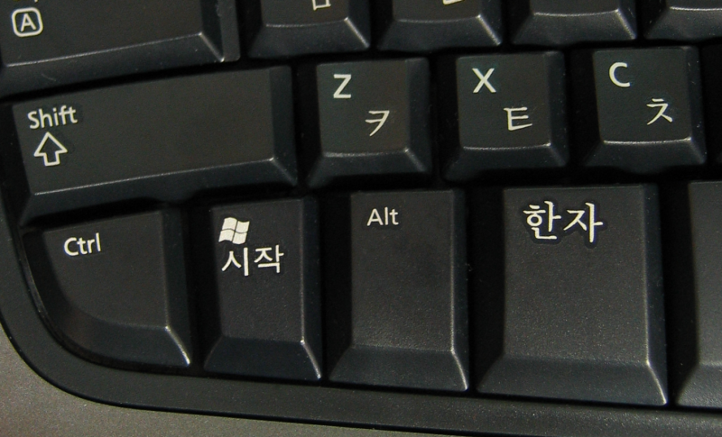
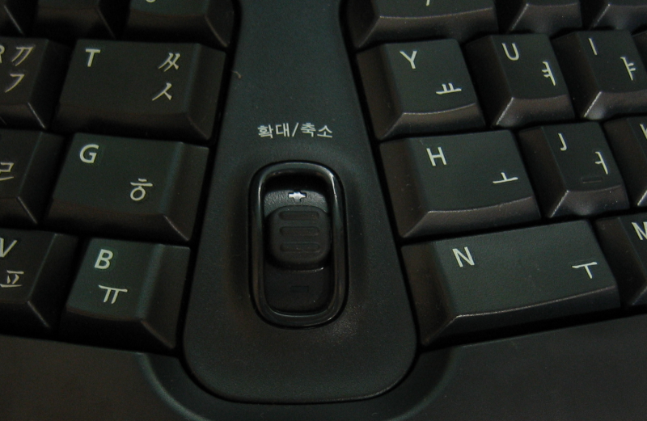

 원래 학생 시절부터 돈이 있으면 항상 컴퓨터 부품을 거의 최우선으로 업그레이드시켰는데 이제는 데스크탑을 어느 정도 빵빵하게 맞춘 후 이제 몇년간 컴퓨터 부품 살 일은 없겠구나 싶었는데, 전에부터 일년에 한번씩 정도 아프던 손목이 아프는 바람에 키보드를 하나 질렀다.
 키보드 종류는 [후배가 잘 쓰고 추천해주던 것](http://kkamagui.tistory.com/442)인데, 볼 때는 꽤 불편해보였는데 와서 써보니 무척이나 편하다. 뭐 100% 의 이전 키보드 속도가 나오는 것은 아니지만 일단 손가락과 손목은 편한듯하다.
 하지만 문제가 딱 2 개 있는데 아마 이건 마이크로소프트에서 만들어서 그런 듯하다. 아마 한글 키보드 관련한 사람이 제대로 테스트를 했다면 쉽게 발견했을 것인데 많이 아쉬운 부분이다.

 첫째 '한자키'가 너무 크다. 실제로 우리나라에서의 컴퓨터 문화는 거의 한자를 컴퓨터로 쓸 일이 없다는 것다고 느낀다.(물론 한자를 쓰는 분이 없는 건 아니고, 특수문자를 많이 쓰는 집단도 있긴하다) 게다가 한자를 많이 쓸만한 관공서는 대부분이 아래아 한글을 쓰고 있으므로 아마 F9 를 더 많이 쓸 것 같다. 여튼 프로그래머의 입장인 나는 한자키를 누를 일이 한달에 한번 있을까 말까인데, 한자키가 왼쪽 ALT 키보다 크다는 것은 좀 에러인 것 같다. 사실 오른쪽 ALT, Ctrl 키는 내가 평소에 거의 누르지 않아서 그냥 '한영키' 가 좀 커도 덜 불편하다.

 두번째로는 모음 중 유일하게 'ㅠ' 만 왼쪽에 붙어있다. 영어 입장에서 B 가 왼쪽에 있는 게 얼~~~마나 외국에서 편한지는 모르겠으나, 한국어의 모음 중 'ㅠ' 만 왼쪽에 가 있으니 뭔가 어색하다. 일단 자음은 모두 왼쪽편에 있고, 모음은 'ㅠ' 를 제외하고는 모두 오른쪽에 있다. 사진에서 보면 알겠지만 N 이 보통키의 거의 2 배인데, 한국 버젼만 N 바로 왼쪽에 B 를 넣고 V 를 N 크기만큼 키웠으면 어땠을까 한다.
 진정한 지역화를 하려면 이런 것에 대해서도 신경을 써줬으면 좋겠다. 설마 나만 이런 생각을 하는 것은 아니겠지? ㅋ
 위의 2가지를 제외하고는 전체적으로 좋다는 느낌이다. 일단, 각도 꺽인 것도 한국인인 나한테도 편한 느낌이고, 각종 단축키를 아직 많이 쓰는 것은 아니지만 꽤 괜찮은 느낌이다. 특히 가운데의 확대/축소 버튼은 왜 인지는 모르겠으나 파이어폭스에서는 스크롤바를 움직이는 키로 되어 있어서 은근히 편하다. 그리고 볼륨조절키도 편하다 :)
 다음에 조금 비싼 키보드를 살 때는 위의 사항도 따져봐야겠다. 특히 주의할 점은 외국에서 만든 키보드는 겉에는 외국키 배열만 프린트 되어 있다는 것이다. 즉, 한글/한자 키가 적용되었을 때 어떻게 되는지 프린트 안되어 있으므로 실물을 꺼내어서 확인해야한다.
 웰빙 음식도 중요하지만 나처럼 컴퓨터를 자주 쓰는 사람들은 웰빙 입력장치와 모니터가 더욱 필요하다는 생각~!  이제 다음은 마우스를 Vertical Mouse 로 바꿔봐야겠다.
