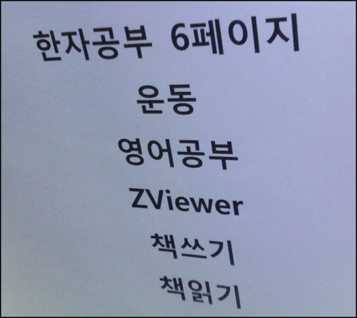

 kldp 에서 오랜만에 [재미있는 글](http://kldp.org/node/94193)을 읽었다. 신세기 사이버 포물러에서의 '제로의 영역' 에 대한 이야기였는데, 한마디로 얘기하자면 '일의 집중도가 일반적인 상황에 비해 극단적으로 높아진 상태' 라고 정리할 수 있을 듯하다.
 멤버십에서 들었던 세미나 강사였던 친구는 '버닝모드' 라고도 얘기했고, 여튼 꽤 많은 사람들이 이 상태를 겪었던 것 같다. 물론 나도 병역특례를 할 때 몇번, [ZViewer](http://zviewer.wimy.com/), [ZAssist](http://www.wimy.com/wiki/wiki.php/ZAssist) 를 만들 때 한 두 번은 겪었던 것 같다. 그리고 당연히 그 때 프로그램의 틀이 제대로 잡혔던 것 같다.
 이 얘기를 한 분은 이 현상이 자신에게서 점점 없어지는 것 같다고 한다. 나도 그렇다. -\_-;; 책상 옆에는 "xx 를 하자, yy 도 하자" 는 A4 용지가 떡하니 붙어져 있지만 실상 웹 서핑을 하면서 블로그에 글 쓰고 있다.... 이런저런 핑계거리가 많고, 방해 거리도 많으니... 라고 변명해보지만 자신의 의지 문제인것 같다.
 얼마전에 아는 형의 블로그에서 [정말 맘에 쏙드는 글](http://dreamsketcher.mybada.com/Remarkable/entry/Find-the-Joy-in-Your-Life)을 발견했었다. "꿈은 계속해서 덧칠해야 이루어지는 것이다." 다시 한번 맘을 가다듬자!! 제로의 영역 속으로!!

