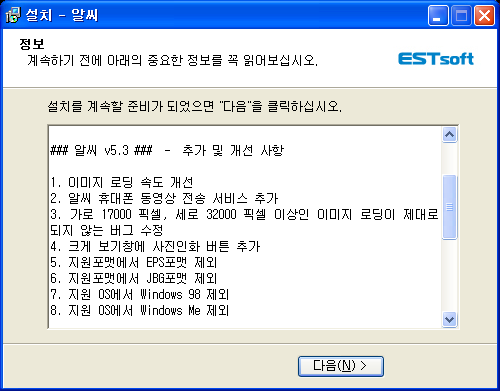

 ZViewer 개발 관련 및 이런저런 이유로 집의 컴퓨터에서는 알툴즈의 알씨를 쓰고 있다.
 형이 알약이 좋다는 말을 해서 알약을 깔려고 홈페이지에 들어갔다가 왠지 ActiveX 생각이 나서 알툴즈 업데이트 프로그램을 통해서 설치하려고 들어갔다가 알씨가 구버젼이라서 업데이트를 했는데, 다음과 같은 업데이트 내역을 보여주었다.

 이미지 라이브러리의 교체나 업데이트가 있었는지 이미지 로딩 속도가 개선되었고, EPS, JBG 포맷의 지원을 더이상 하지 않는 것이 눈에 띄인다. 그리고 가로 17000, 세로 32000 픽셀 이상인 이미지 로딩을 보면서 저런 이미지 파일도 있구나 하는 생각...
 그리고 지원 OS 에서 드디어(!) 윈도우98 과 윈도우ME 가 빠졌다. 국민 프로그램으로도 불리는 알씨리즈에서도 저 OS 들의 지원이 중단되었다. ZViewer 도 프로그래밍의 문제 및 유니코드 문제로 지원을 중단한 OS 다. 이제 슬슬 프로그래머들이 NT 기반으로만 프로그래밍해도 되는 세상이 오려나...

