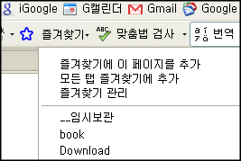
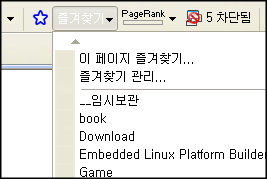

 firefox 3.0 의 발표와 함께 막상 옮겨가지 못했던 이유는 [Google labs 의 Browser Sync 플러그인](http://www.google.com/tools/firefox/browsersync/)이 [3.0 용이 안 나올 것이라는 것과 곧 서비스가 중단될 것](http://googlesystem.blogspot.com/2008/06/google-browser-sync-to-be-discontinued.html)이라는 것 때문이었다.
 그래서 대안으로 제시된 것이 몇개 있었는데 그 중에서 "그래도 같은 구글 것을 쓰자" 라는 생각에 구글 툴바의 즐겨찾기 기능을 쓰기로 했다. 결과는 대만족~ 일단 Browser Sync 처럼 따로 로그인할 필요도 없었고, 가장 마음에 드는 것은 파이어폭스만이 아니라 IE 에서도 공유된다는 것이다. 물론 IE 용 구글 툴바를 깔아야 하긴 하다.
 써보고 좋은 점은 다음과 같다.
 \* 구글 툴바에서도 "별표" 를 한번 클릭하는 것만으로 즐겨찾기에 등록
 \* Firefox, Internet explorer 양쪽에서 공유할 수 있음
 \* 웹에서도 볼 수 있음
 \* 여러 즐겨찾기를 동시에 탭으로 열기, 현재 모든 탭을 저장등 가능
 \* 하나의 즐겨찾기를 gmail 처럼 여러개의 label 을 붙일 수 있음

