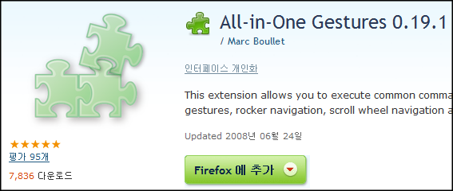

 firefox 3 으로 오면서 조금 불편했던 것 중의 하나는 가장 즐겨쓰는 All-in-One Gestures 가 3.0 용으로 없다는 것이었다. 누군가가 사용가능한 버젼 정보만 고쳐서 올린 버젼이 있긴 하지만 불안하다는 말이 있었고, 결국 대부분의 사람들은 FireGestures 로 옮겨탔다. 나도 "뭐 어쩔 수 없지. 아직도 안 나오는 걸 보면(rc 기간도 많았는데) 개발을 더이상 안 하려나" 는 생각에 FireGestures 를 깔아서 firefox 3 를 쓰기 시작했다.
 하지만 2008년 6월 24일자로 All-in-One Gestures 가 firefox 3.0 을 지원하기 시작했다. 나는 바로 All-in-One Gestures 로 돌아갔다.
 All-in-One Gestures 가 FireGestures 보다 편하다고 생각하는 기능은 다음과 같다.
 \* 탭이 하나 남았을 때 제스쳐로 현재 문서를 닫으면 firefox 가 종료된다(FireGestures 는 '빈문서' 탭이 남고 종료되지는 않는다).
 \* 마우스 오른쪽 클릭을 유지한체 마우스 왼쪽 클릭을 하면 Backward 가 된다.(실제로 제스처 그리는 것보다 빠르게 입력 가능)
 \* 제스처를 입력하고 잠시 오른쪽 버튼을 안 떼고 있으면 제스처가 취소된다.(잘못 입력시에 유용한 기능)
 마지막으로 나에게 몇년간 써오면서 기본 제스처들이 익숙하다는 점도 +a 가 된다~

