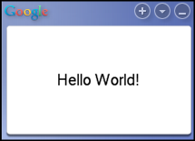

 오랫동안 ToDo 목록에만 들어있던 'Google Desktop Gadget 만들기' 를 해보았다. 한문 5급 준비를 하면서 외워야할 문장들을 화면에 하나씩 보여주는 '[똑똑이](http://softnsoft.com/pg_ddokddoki.htm)' 라는 프로그램을 쓰게 되었는데, 이 프로그램이 구글 데스크탑 사이드바에 들어가면 좋겠다라는 생각이 들어서 틈틈이 만들어보았다.
 내 기억으로는 가젯을 만들기를 2~3번쯤 시도해보았었는데, 그 때마다 COM DLL 을 쓰는 등 복잡했었던 기억인데, 지금 해보니 COM 이런거 없이 자바 스크립트로 너무 쉽게 되었다. 그동안 사용법이 바뀐 건지, 내가 엉뚱한 문서를 보고 있었는지 모르겠다. 일단 간단한 가젯을 만들기는 너무 쉽다. 다음과 같은 과정으로 만든다. 다음의 과정은 [구글 공식 문서 - Modifying Hello World -](http://code.google.com/apis/desktop/docs/Tutorials/ModifyHelloWorld/index.html) 를 간단히 한 것이다.

1.  [SDK 를 다운](http://code.google.com/apis/desktop/)받아 설치한다.
2.  설치된 SDK 폴더에서
3.  HelloWorld 를 내가 원하는 폴더(C:\\GD\_SDK\\myTest 등)에 복사한다.
4.  복사한 폴더에서 .gg 파일을 더블클릭한다.
5.  HelloWorld 가젯이 구글 데스크탑 사이드바에 보여진다.

 위와 같이 간단한 과정을 거치면 프로그래밍 세계에서 항상 첫발을 내디디는 Hello World 를 짜본것(?)이다. 이제부터는 HelloWorld 를 수정해나가면서 원하는 기능을 하나씩 넣으면 된다. API 는 [구글 공식 문서 - Gadget API Reference -](http://code.google.com/apis/desktop/docs/gadget_apiref.html) 를 참고하면 된다.
 간단히 위의 '똑똑이' 라는 프로그램의 핵심 기능만 구현해보았는데, 전체적인 프로그래밍 방법은 ASP.NET 과 비슷해 보인다.
- main.xml 파일을 수정해서 UI 를 만들고, UI 의 html tag 같은 것에 name 을 붙인다.[2009/05/23 - \[일반\] - 노무현 전 대통령 서거](http://blog.wimy.com/241)
- main.js 파일에서 UI 의 name 을 사용해서 각종 property 를 수정하거나 함수를 호출하고, event 시의 call back 함수 반응을 해준다.
 구체적인 API 방법 등은 <http://zelon.springnote.com/pages/3459357> 에 정리한다.
 정말 간단한 몇 줄의 스크립트 작성만으로 멋진 Gadget 을 만들 수 있는 환경은 정말 재미있는 경험을 제공해준다. 처음 프로그래밍을 접하는 사람에게, 프로그래밍에 대한 흥미를 일으킬 수 있게 해주는 도구(!)로 써도 될 것 같은 느낌이다. 프로그래밍에 흥미를 가지려는 분들은 시간될 때 간단히 한번 해보시길. :)
 앞으로 조금씩 업데이트는 [위키 페이지(http://zelon.springnote.com/pages/3459357)](http://zelon.springnote.com/pages/3459357 "[http://zelon.springnote.com/pages/3459357]로 이동합니다.")에 정리함~

