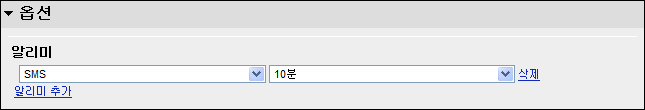

 드디어!!! 구글 캘린더에서 공식적으로 한국에서의 문자 알리미 서비스를 시작합니다. 다행(?)스럽게도 무료입니다~~ 완전 고마워요~ 구글 ㅎㅎ 이젠 '음력지원' 만 남았어요 -0- 과연~~?
 간단히 테스트를 해보았더니 잘됩니다. 다만 이제 알리미 시각을 위해서 '종일' 로 선택되어 있던 것을 특정 시각으로 맞춰야하는군요. ㅋㅋ '종일' 로 되어 있으면 10분전 문자 알림을 선택해 놓으면 전날 11시 50분에 오겠죠? -\_-;
 http://googlekoreablog.blogspot.com/2008/08/google.html
