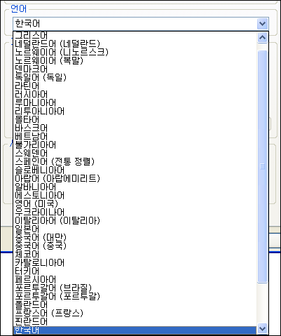

 프로그램을 짜다보면 점점 더 많은 욕심을 가지게 된다. 물론 나만 쓰는 프로그래밍라면 정말 간단히 만들고 더욱 재미난 주제를 찾아다니겠지만, 어느 정도 시간과 노력을 들이고, '배포' 라는 것을 하고 나면 사용자들의 요청과, 자신이 쓰다보면서 발견하게 되는 불편함을 느끼게 된다.
 그 중 '언어' 라는 것은 조금 특이하다. 사실 내가 만든 ZViewer 를 영어권에서 쓰리라고 생각하지 않는다. 하지만 '내가 국제화된 프로그래밍을 할 수 있을까' 라는 생각에 시작하게 되었다. 모든 것이 그렇겠지만 일단 시작하기가 힘든 법! 지금도 느끼는 거지만 정말 다양한 방법이 있다. 특히 Windows 용 프로그램의 경우 resource 파일을 여러 언어에 맞게 만드는 방법이 가장 널리 쓰이는 표준적인 방법으로 볼 수 있고, 리눅스를 비롯한 오픈소스 쪽에서는 po 파일을 이용하여 msgid 를 msgstr 으로 매핑하는 방법을 쓰고 있다. 그리고 여기저기서 쓰이는 가장 간단한 방법 중의 하나인, Java 에서 즐겨쓸만한 ini 파일 형식을 이용한 방법이 있다.
 현재 ZViewer 에서는 메시지 관련 부분은 ini 파일에
FILE\_ERROR=파일오류
와 같은 방법을 주로 쓰고, UI 부분은 resource 파일을 수정하는 방법을 쓰고 있는데 시간이 되다면 po 파일을 이용해서 국제화를 하려고 한다. po 파일처럼 널리 쓰이는 방법을 통해 프로그래밍을 하다보면 다양한 방법을 접하게 될 뿐만 아니라, 오픈소스의 여러 프로그램들을 좀 더 쉽게 소스를 볼 수 있게 될 듯 하다.
그리고 마지막까지는 남아있겠지만 설치 프로그램인 NSIS 쪽의 번역이다. NSIS 쪽의 번역을 살펴보면 재미있는 것이 ZViewer 처럼 미리 제공되는 언어별 UI 는 NSIS 자체에서 제공하고, 세부적으로 필요한 것들은 ini 파일처럼 쓰여지고 있다.
 물론 이런 '여러 언어를 위한 프로그래밍' 을 하기 전에 필요한 것은 역시 '[유니코드 프로그래밍](http://www.wimy.com/tt/tag/%EC%9C%A0%EB%8B%88%EC%BD%94%EB%93%9C)' 이다. :)
ps : ZViewer 는 언제쯤 '영어' 외의 언어를 지원하게 될까? ^^;;;

