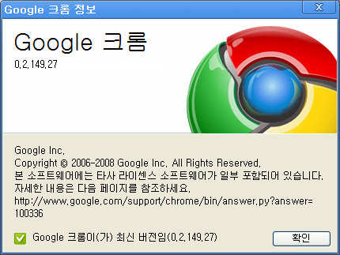

 며칠 늦은 포스팅이지만 적고 싶은 말은 적어야 하기에 적어봅니다. ^^ 참고로 제가 주로 쓰는 웹 브라우져는 파이어폭스입니다.
 구글에서 크롬이라는 웹 브라우져를 발표했습니다. 제 주위에 오픈소스에 큰 관심없고, 최신 IT 에 민감하지 않은 분들조차 웅성거리는 것을 보니 구글의 영향력이 크다는 느낌을 새삼스레 받았습니다. 크롬의 좋은 점은 블로그들에 널려있으니 생략하고 제가 느낀 안 좋은 점을 적어보렵니다. 물론 전체적인 느낌은 깔끔하고, 괜찮다는 느낌입니다. 개인적으로 구글도 완전 좋아하구요. 하지만 평가는 객관적으로 하려고 합니다 ^^
 일단 크롬을 설치해본 첫 소감은 좋지 않았습니다. -\_- 회사에서 왠일인지 작동을 안하더군요. 정확히 말하면 프로그램은 실행되나 웹 페이지 로딩이 되지 않았습니다. 웹 브라우져가 웹 페이지 로딩이 안되니 작동이 안하는 셈 -\_-;;; 뭐 저희 회사가 프록시를 쓰는 등 좀 복잡한 환경이긴 하지만 파이어폭스도 프록시 설정만 하면 잘 동작하는데 왜 크롬은 안되는지 좀 난감합니다.
 두번째로 집에서 설치해보았는데, 제가 올해 입사 후 거금을 들여서 산 컴퓨터라 그런지 기존 환경과 차이가 체감되지 않습니다 -\_-;;; 아... 전 구글 완전 좋아하는 편인데 크롬에 건 기대가 너무 많았던 것일까요.... 여튼 체감 속도는 다른 분들의 글처럼 '완전' 빠른건 아닙니다. 그냥 '빠른듯?' 이라는 느낌입니다.
 세번째로 뭔가 이상한 점은 각 탭이 하나의 프로세스로 동작한다고 되어 있어서 다음과 같은 실험을 해보았습니다. 기존에 웹 프로그래밍을 하면서 가장 불편했던 점 중 하나가, 하나의 탭에서 "alert();" 함수로 창이 떠 있으면 다른 탭으로 갈 수 없다는 것이었는데, 하나의 탭이 하나의 프로세스를 쓴다면 당연히 하나의 창에 alert 가 떠있어도 다른 탭으로 이동이 가능할꺼라 생각했는데 안되더군요............ 여기서 좀 실망해버렸습니다 -\_-/
 네번째로는 조금 쓰다보니 마우스 제스쳐 안되고, 구글 툴바 없고(-\_-), 닫힌 탭 다시 열기는 못 찾겠고, 주소줄 2~3개쯤있으면 검색이 편한데 그런것도 없고, PicLens 도 안되고;; 자그마한 것들이 많이 아쉽다는 느낌입니다.
 이제 시작인 크롬에 너무 많은 기대를 한 것일 수 있습니다. 마치 구글 토크가 처음 나왔을 때의 느낌을 많이 받았습니다. 구글이니까 뭔가 있겠지라고 생각하지만, 첫인상이 깔끔하고 괜찮다라는 생각이 없어지고 나면 세세한 기능이 조금 아쉽다는 생각이 듭니다. 하지만 gmail, google docs 가 지금은 꽤 쓸만해진 것처럼 지켜보아야겠죠?

