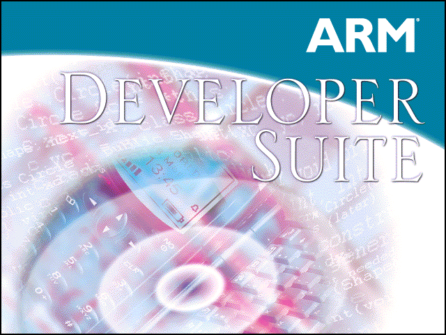

 회사에서 ARM 컴파일러의 사용을 위해 ARM Developer Suite 를 설치한다. 그런데 이상하게 내 노트북에서 설치 중 이상한 현상이 발생했다.
 열심히 설치하는 도중 프로그레스바가 진행되다가 100% 까지 올라가서 멈춰버리는 것이다. 취소해도 안되고, 결국 process kill 을 할 수 밖에 없었다. 그런데 문제는 이렇게 설치를 취소한 후 다시 setup 을 하게 되면, Modify, Repair, Remove 만 뜨며, Modify 로 재설치시에 C:\\windows 에 설치되어 버리며(-\_-), 시작 메뉴에 제대로 등록이 안되는 현상이 일어난다. 결론적으로 Remove 를 해도 제대로 제거가 되지 않으며, Modify 를 할 시에 C:\\windows 를 기존의 설치폴더로 인식해버려서 발생하는 문제였다.
 해결책은 다음과 같이 하면 된다.
 HKEY\_LOCAL\_MACHINE\\Software\\Microsoft\\Windows\\CurrentVersion\\Uninstall
 의 하위키들 중에서 Display Name 으로 찾아서 해당 키를 삭제하면 됨. 즉, 설치 정보를 제거해버리는 것이다. 이렇게 한 후에 다시 설치하면, 처음 설치하는 것처럼(!) 제대로 설치가 된다.

