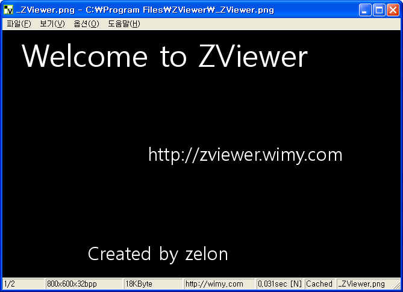

 요즘 틈틈이 ZViewer 를 손보고 있다. 얼마전 사진 정보(exif data)를 보여주는 기능을 추가했고, 파일 경로 관련 유니코드 버그를 수정했다. 처음 문자 관련 소스를 유니코드로 수정하면서 다 수정한 줄 알았는데, 결정적으로 freeimage 라이브러리에 파일이름을 유니코드함수를 호출하지 않고 기존의 함수를 호출하는 실수를 -\_-;; 여튼 이제는 파일명이 유니코드인 파일을 잘 보여줄 수 있게 되었다.

 혹시 파일명이 좀 의심스럽고 다른 이미지 뷰어에서 안 열릴 때는 이후에 발표될 ZViewer 를 이용해보세요^^/
 사실 지금 작업 중인 것들은 내가 DSLR 을 구입하면서 사진들을 보다가 보통 다른 이미지 뷰어들이 자동회전기능을 지원하는데, ZViewer 에는 지원하지 않아서 시작한 일련의 작업들이었다. 자동회전을 하자니 회전정보가 필요하고, 회전정보를 얻고나니, 회전시키는게 너무 느린거 같아서, 관련 코드를 보다보니까, 하는김에 zoom 도 빠르게 하자 싶어서 관련 코드를 수정 중이다.
 원래는 사진 정보 보기만 해서 0.7.0 버젼으로 릴리즈하려고 했으나, 뭔가 2% 부족해서 zoom 기능을 추가한 다음에 릴리즈하기로 했다.(릴리즈하려고 subversion 에 tag 까지 달았는데.. 뭔가 스스로 용납이 안되었음 ㅋ)
 요즘 문제거리는, 이상하게 StretchDIBits() 함수에서 사진을 축소하면 색깔이 많이 깨어지는 것이었다. 이거 때문에 고생을 좀 했는데 생각해보니, 2개의 픽셀을 하나의 픽셀에 쓰게 되면, SRCCOPY 원리에 의하면, 항상 뒤의 픽셀이 앞의 픽셀을 덮어쓸 것이다. 그러면 사진 같은 경우에는 불량 화소(CCD의 특성상 생기는)들이 곳곳에 있는데(확대해보면 안다) 이런 불량 화소들이 덮어버리게 되고, 사진의 이미지는 작아지는데, 불량화소는 남아있어 결과적으로 불량화소가 더 눈에 띄이게 된다. 뭐 이런 것 같다. 그래서 열심히 찾아보니, 결국 구글님의 도움으로 찾아낼 수 있었다. 결론적으로는 SetStretchBltMode(hDC, COLORONCOLO) 을 쓰면 된다는 것!
 [CountS 님의 글](http://counts.tistory.com/6)을 보고 해결했다. 정말 감사~~ 배너라도 있었으면 클릭해드리려했는데 아쉽게도 ㅎㅎ 이런 내용들, 우리 한글로 된 정보가 인터넷에 많은 분들의 노력과 정성으로 더욱 많아졌으면 좋겠다 :)

 얼른 남은 작업해서, zoom 을 +,- 키로 조절할 수 있고, 자동 회전되는 버젼을 만들어서 0.7.0 버젼으로 릴리즈해야겠다. 과연 올해 안에 릴리즈 할 수 있을지~~~ ^^;;

