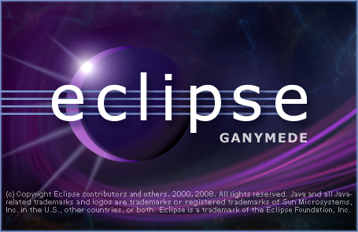

 만족할만하거나, 2% 부족한 소프트웨어를 쓰면서 항상 다음 버젼을 기대하는 건 즐거운 일이다. 한 때 0.0.1 버젼이라도 높은 소프트웨어를 쓰려고 노력하던 분들도 많았을 것이다. 그리고 일반적으로 소프트웨어가 업데이트되면서 당연히 좋은 기능들이 추가되므로 좀 더 높은 버젼을 쓰는 것이 좋다.(물론 이상해지는 경우도 있긴 하다 -0-)
 많은 이들의 관심을 받고 있는 eclipse 는 현재 3.4 버젼으로 ganymede 라는 이름을 가지고 있다. 모든 프로그램이 그렇듯이 하나의 버젼이 발표되면서, 발표된 버젼을 패치하면서, 동시에 다음 버젼을 준비해간다. eclipse 의 다음 버젼은 3.5 버젼이 되며, 2009년 2분기에 발표예정이다. 난 아직 3.4 버젼을 열심히 손에 익히는 중이라 3.5 버젼은 관심도 없었는데, 문득 [어느 글](http://alankang.tistory.com/173?_new_tistory=new_text)을 보면서 한번 살펴보게 되었다.
 eclipse 는 개발 중에 milestone 이라는 단위로 개발되는데 줄여서 M 이라고 표기한다. 현재 3.5(갈릴레오)는 M3 까지 개발되었으며, 각각의 링크는 [M1](http://download.eclipse.org/eclipse/downloads/drops/S-3.5M1-200808071402/3.5M1/eclipse-news-M1.html), [M2](http://download.eclipse.org/eclipse/downloads/drops/S-3.5M2-200809180100/eclipse-news-M2.html), [M3](http://download.eclipse.org/eclipse/downloads/drops/S-3.5M3-200810301917/eclipse-news-M3.html) 이다.
 현재까지 개발된 기능들 중 눈에 띄이는 다음과 같다.
- Word 파일 비교가 가능([자세한 내용은 링크 참조](http://wiki.eclipse.org/Compare_Word_Documents)) - 윈도우만 가능
- Compare Dialog 에서 다른 폴더나 파일등을 선택하는게 가능
- Comment 시작 위치에서 더블 클릭시에 Comment block 선택
- 보다 쉬워진 업데이트 체크
- SWT 에서 Vertical Selection 이 가능해짐.(Visual Studio 에서 Alt + 드래그)
- PDE 부분에서 병렬 컴파일 가능
\* 참고로 [3.5 버젼용 CDT 인, CDT 6.0](http://wiki.eclipse.org/CDT/planning/6.0) 에는 C++ 의 다음 표준인, C++0x 에 대한 계획이 있다.
 m3 까지 오면서 꽤 많은 기능이 추가되었는데 내 눈에 띄는 기능은 위와 같다. 내년 2분기까지 얼마나 더 좋은 기능들이 추가될지... 그리고 위의 eclipse 와 별개로 CDT 는 얼마나 더 좋아질지 기대된다. Visual Studio 의 컴파일러를 쉽게 쓸 수 있게 해준다던지, sln, vcproj 파일을 makefile 로 자동으로 만들어준다던지 이런거를 기대하는 건 너무 무리이려나? ^^
ps : 생각해보니 저런 것을 해주는 스크립트를 짜면 될듯 -\_-;;

