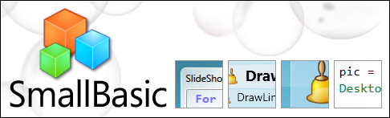
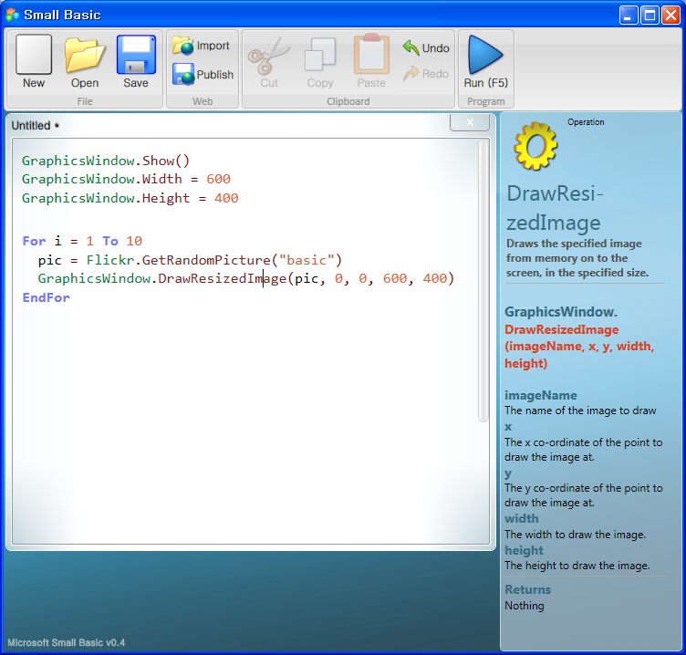
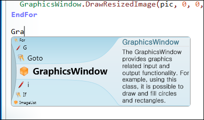

 [Microsoft 의 Small Basic](http://msdn.microsoft.com/en-us/devlabs/cc950524.aspx "[http://msdn.microsoft.com/en-us/devlabs/cc950524.aspx]로 이동합니다.") 은 프로그래밍을 처음 시작하는 초보자를 위한 언어이다. 무료이며, 약 4MB 의 설치 파일이다.  [\[홈페이지\]](http://msdn.microsoft.com/en-us/devlabs/cc950524.aspx "[http://msdn.microsoft.com/en-us/devlabs/cc950524.aspx]로 이동합니다.")
 Microsoft 의 메일링 리스트에서 우연히 보게되어 설치를 해보았다. 이름 그대로 Small Basic 은 몇개의 기본적인 명령어들과 도구들을 통해서 프로그래밍을 시작하게 해준다. 우리의 eclipse 나 Visual Studio 를 보자. 대체 몇개의 툴바와 명령어들이 주우욱~~ 보여지는지... 다음은 Small Basic 의 기본 화면이다.

입력하고, 실행해보면 된다. 그런데 재미있는 것이 intellisense 기능이다.

 MS Visual Studio .NET 보다더 멋드러지게 보여준다. :)
 그리고 소스 편집창 오른쪽에 dynamic help 도 눈에 띄인다.
 Small Basic 에는 기본적으로 다음과 같은 객체들을 제공해준다.

-   TextWindow : 콘솔창에 값을 쓰거나, 사용자의 입력을 받는다.
-   GraphicsWindow : 화면에 무엇을 그린다.
-   Turtle : 거북이 한마리를 나오게 해서, 전진, 후진, 회전 등을 시킨다(python 의 거북이처럼!)
-   Flickr : Flickr 에서 이미지를 다운받게 해준다(!!!!)
-   Desktop : 바탕화면 가로, 세로 길이를 얻어오고, Wallpaper 를 설정하게 해준다.
-   Network : 인터넷의 파일을 다운 받거나 내용을 얻어오게 해준다.

정말 간단하면서도 재미있게 프로그래밍을 익힐 수 있는 객체들로 꾸며져있다. 그리고 간단한 이벤트 처리도 제공해주어, MS 에서는 벽돌깨기 게임을 예제로 들어주었다.
"프로그램을 어떻게 만들어요?" 라고 묻는 아이들이나, 주위 사람들에게 한번 보여주자 :)

