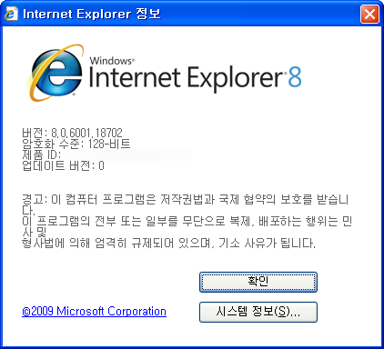

 얼마전(5월초쯤) Internet Explorer 8 이 자동 업데이트 목록에 나타나서 업그레이드를 시켰다. 바로 옆에 아직 업그레이드 안된 컴퓨터와 VirtualBox 도 있고, 여기저기에 은행권에서 큰 문제가 없다는 포스트도 보아서 업그레이드를 시켰다.
 일단 쓸 때 느끼는 건, 속도가 좀 빨라졌다는 것이다.(어쩌면 그냥 7보다 빠를뿐 6보다는... 6를 안쓴지는 좀 오래 되어서 딱히 뭐라할수는 없겠다) 이렇게 느껴질 정도면 속도개선이 꽤 있었는 것 같다. 주로 쓰는게 파이어폭스이다 보니, 게임 관련해서 파이어폭스에서 문제가 조금 있는 사이트들만 가는 정도라서 자주 쓰지는 않는 상황이다. 단, 이제 8 버젼이 자동 업데이트 목록에 뜬다는 건 앞으로 상당수가 8 버젼으로 옮겨갈 것이라는 것이다. 7 은 마치 윈도우 비스타처럼 여기저기 문제가 많고, 잦은 다운(Crash) 및 느린 속도로 문제가 많았으나, 8 은 아직까지는(마치 Windows 7 처럼) 꽤 괜찮은 버젼으로 평가되고 있다.
- yes24.com 에서 책을 사려고 했는데 오류를 일으키면서 결제를 할 수 없었다. 고객센터에 문의를 해보니 IE8 로 업그레이드한 고객들이 비슷한 문의를 많이 한다면서, 현재로는 수동설치를 하라고 한다.

