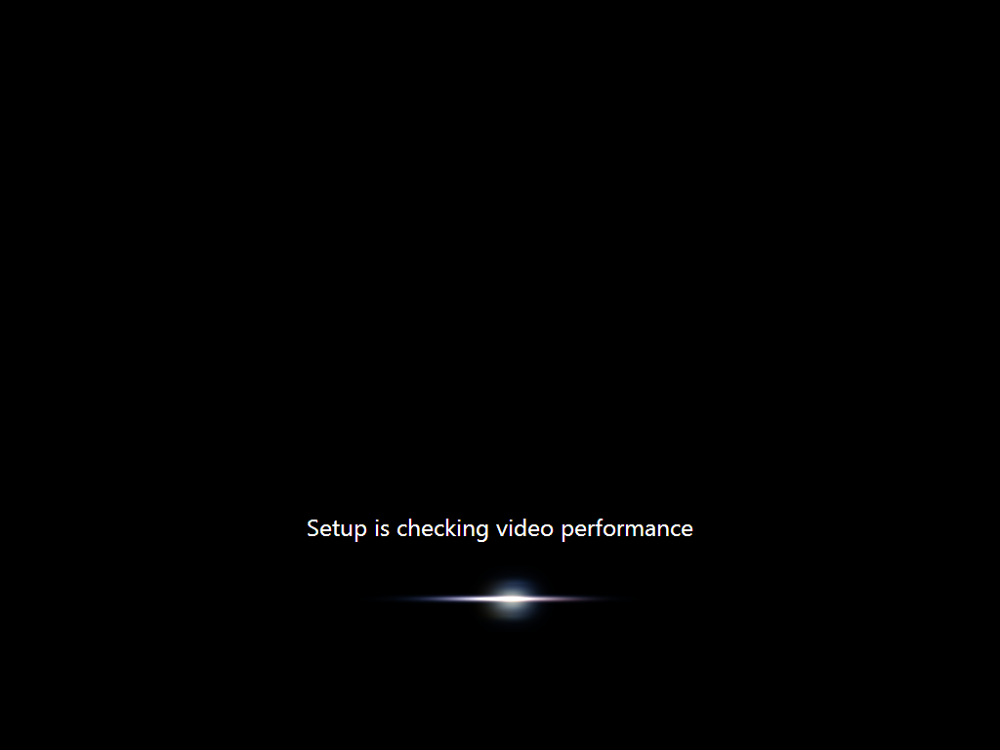

 드디어 일반 사용자들도 [Windows 7 RC 를 다운\[링크\]](http://www.microsoft.com/windows/windows-7/download.aspx "[http://www.microsoft.com/windows/windows-7/download.aspx]로 이동합니다.") 받을 수 있게 되었다.
 해당 링크에서 32비트, 64비트를 골라서 다운받을 수 있으며, 다운로드를 시작하면, Java 프로그램을 통해서 다운로드를 받기 시작한다. 약 2시간쯤 걸린 것 같다(2009.05.05. 현재).

 Windows 7 RC 버젼은 2010년 6월 1일까지 사용할 수 있지만, 3월 1일부터는 2시간마다 자동으로 PC 가 종료된다. 최소 설치 사양은 RAM 1GB(VirtualBox 에 1GB 로 설치했음), HDD 16GB이다. 설치 후 기본 용량은 약 6.6GB 가 사용되었다.
 VirtualBox 를 통해서 설치를 해보았는데, 설치과정이 훨씬 간단해진 것 같다. 일단 그래픽 환경에서 설치를 시작했으며, 영문판이지만, 한글 입력이 가능하다(설치 중 Korea 를 선택하는 부분이 있어서인듯).

 개인적으로 기본 wallpaper 는 좀 마음에 들지 않는다. 뭐랄까... 추워보이고, 안되보이는 물고기이다 -\_-; 일단 설치 후에 네트웍이 잡혀서인지 새로운 업데이트가 있다고 한다. 오디오 드라이버 업데이트였다.

 기본 바탕화면 중 마음에 드는 것으로 바꾸어보았다. 기본적으로 제공되는 바탕화면 중 예쁜 게 꽤 많이 제공되었다. 그리고 개인적으로 개발 중인 [ZViewer](http://zviewer.wimy.com "[http://zviewer.wimy.com]로 이동합니다.") 를 설치해보았다. 큰 에러 없이 잘 동작하였다.

 마지막으로 로그인 화면이다. 로그인 화면은 정말 깔끔하고 예뻐졌다.
 개인적으로 설치 후 기본적으로 나타나는 바탕화면은 좀 마음에 안 들지만, 기본적으로 제공하는 바탕화면들은 예쁜게 많았다.
 설치 후 기본적으로 [ZViewer](http://zviewer.wimy.com "[http://zviewer.wimy.com]로 이동합니다.") 를 설치해보았다. 프로그램 실행도 잘되고, ZViewerAgent 로 '탐색기 확장' 도 잘된다. :)
 과연 Windows7 이 얼마나 파급효과를 가질지 기대된다.

