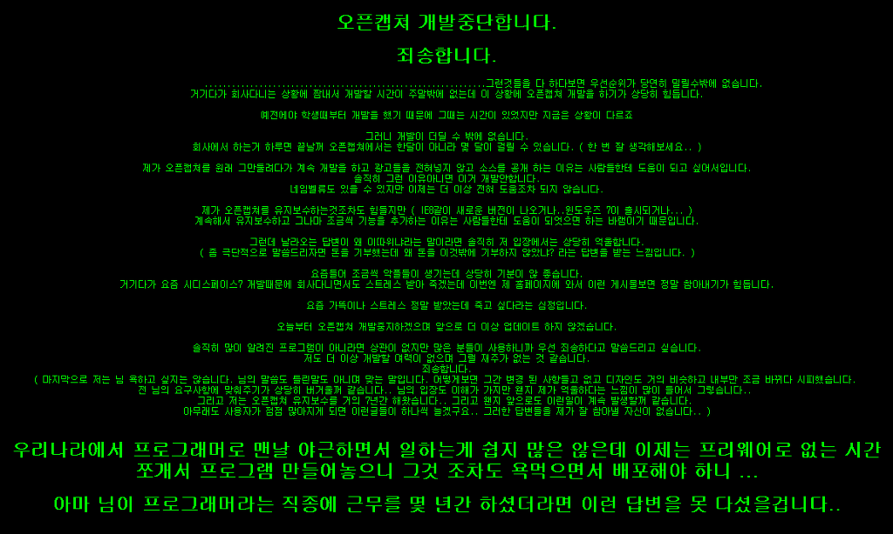

개발자님 : 정룡옥님(CDSpace 7 개발자)
개발자님 블로그 : <http://lain32.egloos.com>
오픈캡쳐 홈페이지 : <http://openproject.nazzim.net/>
오픈캡쳐 게시판 : <http://openproject.nazzim.net/zboard_91F09948-CA47-4da8-BDD8-3E6B5FDA256D/zboard.php?id=anilove32>
 오픈캡쳐는 제가 캡쳐 프로그램을 쓰기 시작할 때 처음으로 썼던 프로그램입니다. 지금까지도 국내에서는 [pickpick](http://picpick.wiziple.net/ "[http://picpick.wiziple.net/]로 이동합니다.") 과 더불어 가장 사랑받는 프로그램 중 하나일 것입니다. 게다가 2008년 1월에는 소스까지 오픈하셨다고 합니다!
 그런데 위와 같은 사연을 남기며, 개발을 중단하셨습니다...... 다른분들과 함께 프로그램을 쓰자고 만들어서 공개했더니 악플을 받고 중단하신 겁니다. 없는 시간 쪼개어가며 프로그램을 개발해서 공개했더니, "왜 이따위냐" 라는 답변을 받으셨다고 합니다. 비슷한 생각을 가지고 작은 프로그램을 배포하는 작은 한 사람으로서 정말 남의 이야기 같지 않습니다.
 개발자님의 글 중 일부를 인용해봅니다.

> 우리나라에서 프로그래머로 맨날 야근하면서 일하는게 쉽지 많은 않은데 이제는 프리웨어로 없는 시간쪼개서 프로그램 만들어놓으니 그것 조차도 욕먹으면서 배포해야 하니 ...

 악플에 너무 상처받지 마시고, 힘내세요!!!
ps : http://lain32.egloos.com/4358307 - 2009년 5월 16일자로 더욱 멋진 분들과 함께 개발을 재개하게 되었다고 합니다. 짝짝짝~ 역시 세상은 살만한가봅니다 :)

