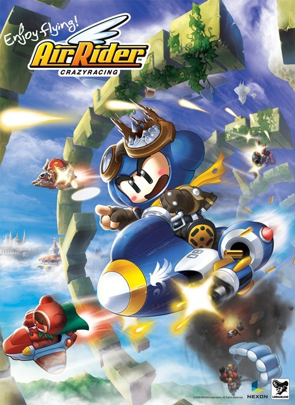

  카트라이더의 후속편이 곧 출시된다. http://www.zdnet.co.kr/ArticleView.asp?artice\_id=20090601104100
 온라인 게임은 지속적인 업데이트가 되기 때문에 실제로 게임이 오픈될 때랑 3년이 지난 지금은 이미 기존의 패키지 게임에서의 2 탄을 넘어선 컨텐츠와 개선된 기능을 가지고 있다. 굳이 카트라이더 2탄을 낸다면 정말 획기적인 변화를 줘야하는데 실제 지금의 카트라이더에서 획기적인 변화를 기대하기는 힘들것이다. 마치 포트리스가 포트리스 패왕전이라는 새로운(-\_-) 게임을 2탄격으로 내놓았으나 큰 변화가 없는 게임은 결국 사장되고 기존의 포트리스 블루가 그나마 명맥을 유지한 선례도 있다.
 리니지는 2D 에서 3D 로의 변화를 하면서 리니지2를 탄생시켰다. 이건 당연히 엄청난 변화를 가져왔기 때문에 충분히 2탄이라는 타이틀을 걸고 나올 수 있음을 누구나 생각할 것이다. 이건 스타크래프트도 마찬가지다. 2D 에서 3D 그래픽으로의 진화(사실 스타크래프트는 온라인 게임이 아니라 네트워크 게임이기에 약간 벗어나긴 한다).
 MMORPG 의 경우는 대부분 2탄이 해주어야할 역할을 확장팩이나 새로운 에피소드를 추가하는 식으로 발전하고 있다. Wow(World of warcraft) 가 대표적이며, 사실 유명한 MMORPG 는 대부분 이렇게 컨텐츠를 대규모 업데이트 시키며, 신규 유저를 모으고, 오랫동안 접속하지 않았던 유저를 끌어모으게 된다. 유료 게임이라면 당연히 유저 증가에 따른 수입을, 무료(대부분 부분 유료) 게임은 컨텐츠 업데이트에 따른 유료 아이템을 팔아 수익을 내게 된다.
 이런 2탄의 역할을 국민게임 카트라이더는 '에어라이더' 에게 넘겨주게 된다. 과연 어떤 행보를 남길지... 2탄을 준비하는 온라인 캐주얼 게임들에게 어떤 영향을 줄지 기대된다.

