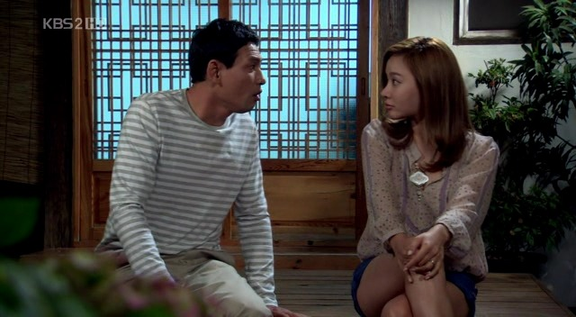

 얼마전 ['그저 바라보다가' - '그바보'](http://movie.daum.net/tv/detail/main.do?tvProgramId=53846 "[http://movie.daum.net/tv/detail/main.do?tvProgramId=53846]로 이동합니다.") 가 종영되었다.
 '네 멋대로 해라' 이후 정말 이렇게 빠져들어본 드라마는 없었던 것같다. 사실 태어나서 제대로 본 드라마는 10개도 안될 것 같은데, 이 드라마는 그 중에서도 꽤 상위권인 것 같다.
 네멋에서의 양동근과 그바보의 황정민... 어리숙하고 착하기만한 남자 주인공. 황정민의 약간 어리숙한 연기는 연기잘하고 못하고를 잘 모르던 내가 봐도 정말 일품연기였다.
 언제나 아낌없이 상대방을 배려하는 모습은 사람의 마음을 움직이는 것 같다.

> 세상에는 나쁘기만 한 것은 없습니다.

..... 긍적적으로 세상을 살아가자.
 당분간 그바보를 잊지 못할 것 같다.
> 구동백씨! 잘 들으세요. 우리.. 결혼합니다. 유감스럽지만 구동백시한테는 선택권이 없어요. 하기 싫어도 하셔야 합니다. 이렇게 된건 다 당신 책임이니까.. 왜 대답이 없어요? 하기 싫으세요? 하긴..당신 대답같은건 필요없어.. 내가 기자회견 다 해버렸으니까...그러니까..당신은 무조건 하는거야! 무조건!!!!

