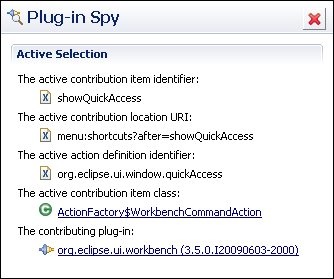

 많은 수정사항들이 있지만, 자세한 사항은 해당 URL 들을 참고하시고, 제 눈에 띄일만한 것들만 적습니다. :)
Eclipse Platform(기본 플랫폼)
- Compare Editor 에서 'Go to Line', 'Set Encoding' 이 지원된다.(대세는 UTF-8!!)
- Microsoft Office 의 Word 파일을 compare 할 수 있다.(대박기능!!!)
 - Window -&gt; Preferences -&gt; General -&gt; Show heap status 를 체크하면 eclipse 에서 사용 중인 heap size 를 화면 오른쪽에 항상 볼 수 있고, 휴지통 아이콘을 누르면 Garbage Collector 를 실행시켜준다.
- Project Explorer 에서 'Go Into' 를 통해 현재 프로젝트에 집중할 수 있게 해준다.

- Vertical Selection 을 지원한다. 단축키는 Alt+Shift+A 선택후 여러줄을 동시에 편집할 수있다.
CDT(For C/C++) - http://wiki.eclipse.org/CDT/User/NewIn60
- Refactoring 중 'Extract Local Variable' 기능이 추가되었다. 특정 부분을 지역 변수로 자동으로 만들어준다.
- 자동으로 특정 헤더 파일을 include 해주는 기능이 많이 향상되었다.
- 여러 단계에 걸쳐서 define 되었을 경우 최종값을 바로 보여준다. F2 를 눌러 중간 과정을 볼 수도 있다.
- indexing 을 할 때 재정의된 연산자도 체크한다.
- 휴리스틱하게 include 할 header 파일을 찾는다.(과연?)
Java - <http://download.eclipse.org/eclipse/downloads/drops/R-3.5-200906111540/eclipse-news-part2.html>
- 클래스 생성자를 좀 더 잘 assistant 해준다.
- 주석의 처음과 시작 /\* \*/ 을 더블클릭하면 전체 주석을 선택해준다.
- 다양한 방법으로 쉽게 toString() 메서드를 만들게 도와준다.
PDE - <http://download.eclipse.org/eclipse/downloads/drops/R-3.5-200906111540/eclipse-news-part4.html>

- Plug-in Spy 를 추가하여 쉽게 플러그인 id 를 알수 있게 해줌(대박기능!!) Alt+Shift+F2

- 작업중인 플러그인을 현재 workbench 에 넣게 해주어서, 개발한 것을 쓰면서 바로 개발 할 수 있다.(재시작은 필요)
기타
-  Subclipse 제대로 동작합니다. :)

