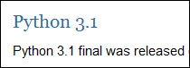

 [Python(파이썬) 3.1 이 릴리즈되었습니다\[링크\].](http://www.python.org/download/releases/3.1/ "[http://www.python.org/download/releases/3.1/]로 이동합니다.")
 자세한 변화는 <http://docs.python.org/dev/py3k/whatsnew/3.1.html> 에서 살펴보시고, 이번에도 간단한 내용만 살펴봅니다 :)
- An ordered dictionary type
 순서가 있는 사전 형식. 기존에는 key/value 로 된 일종의 해시맵의 내용을 하나씩 얻어올 때 임의의 순서대로 얻어왔다. 하지만 이제 collections.OrderedDict 클래스를 사용하면 순서대로 얻어올 수 있다.
- builtin 함수인 format() 이나 str.format() 을 이용하여 다양한 형식 지정자를 사용할 수 있다.
 C 의 printf() 의 %d, %02d 처럼 다양한 형식으로 표현할 수 있다.
- 새로운 유닛테스트 기능이 추가되었다. 테스트를 건너뛰는 기능과 새로운 assert 메서드가 추가되었다.
- int 타입에 대한 다양한 최적화
- 더욱 빨라진 io 모듈(3.0에서는 파이썬으로 제작했으나, 3.1에서는 C 로 다시 제작)
- Tile support for Tkinter
- A pure Python reference implementation of the import statement
- 중첩된 with 문을 위한 새로운 문법
- 기타
  \* raound(x,n) 함수가 x 가 interger 이면 integer 를 반환한다.
  \* UTF-8, UTF-16, LATIN-1 의 디코딩이 2~4배 빨라짐

