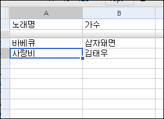

 지난 주에 <http://pop.wimy.com/> 에 자신의 곡 목록을 구성해서 듣는 기능을 추가했다. 로그인해서 목록 관리하고 이런게 은근히 번거럽고, 개인정보 관리하기 싫고 해서, 구글 docs 를 이용하기로 했다.
 http://pop.wimy.com/mylist.htm 에 간단한 매뉴얼을 작성했는데, 구글 docs 에서 스프레드시트를 만들어서 자신의 듣고 싶은 곡 목록을 만들고, 웹에 게시한 후에 문서의 key(고유번호)를 pop.wimy.com 에 넣어주면 된다.
 이제 어느 정도 pop.wimy.com 에 원하는 기능은 다 넣었는데, 누군가 디자인만 좀 도와주면 좋겠다 -0-;; 아니면, 누군가 여기에 추가할 멋진 아이디어라도 제공해주면 좋겠다 :)

