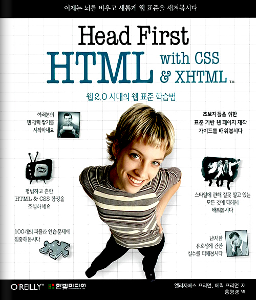

 ['Head First HTML with CSS & XHTML' 이라는 책](http://books.google.co.kr/books?id=KgXsMQAACAAJ&dq=Head+First+HTML+with+CSS+%26+XHTML&lr=lang_ko&as_drrb_is=q&as_minm_is=0&as_miny_is=&as_maxm_is=0&as_maxy_is=&as_brr=0&ei=UOPuStKyG4HClQTuz_mFDA "[http://books.google.co.kr/books?id=KgXsMQAACAAJ&dq=Head+First+HTML+with+CSS+%26+XHTML&lr=lang_ko&as_drrb_is=q&as_minm_is=0&as_miny_is=&as_maxm_is=0&as_maxy_is=&as_brr=0&ei=UOPuStKyG4HClQTuz_mFDA]로 이동합니다.")을 회사에서 빌려서 보는데 정말 내가 평소에 궁금해하던 모든 것들을 알 수 있었다. 이 책은 나중에 책을 살 때 내 개인적으로 살까 생각 중이다. effective C++ 과 디자인 패턴책 이후로 정말 오랜만에 감동 받은 책...(사실 그동안 읽은 책이 몇 권 안 되기도 했지만 ㅋ)
 html4 와 xhtml 의 차이(그리고 나중에는 html5 와의 차이를 공부해야겠지만). 그리고 CSS 의 기본적인 내용들을 정말 세세하게, 재미있게 짚어주고 있다. 그리고 당연히 요즘 진행 중인 [pop.wimy.com](http://pop.wimy.com "[http://pop.wimy.com]로 이동합니다.") 에 적용했다. 확실히 그나마 학교 숙제 같은 디자인에서 그나마 아마추어 같은 페이지로 거듭난듯 하다.
 <http://zelon.springnote.com/pages/3530199> 의 하위 페이지에 조금씩 내가 잘 몰랐던 부분들만 모아서 정리하는 중...
 그리고 내가 원하던 부분을 발췌해서 읽기를 끝내고, 책이 정말 마음에 들어서 처음부터 읽는 중인데, 놀라운 내용이 적혀있었다. 이 책은 굉장한 학습법을 적용해서 만들어진 책이었다. 예를 들면 그림이 많으면 이해가 쉬운데, 그림 밑에 텍스트가 있는 것보다는 그림 안에(정말 설명이 필요한 곳에) 있으면 좋다는 등, 책을 보면서 물을 많이 마시라는 등, 대화체가 훨씬 기억이 잘 된다는 등의 기법들을 가지고 만든 책이었다. 다시 한번 더 감동... ㅠㅜ
 html 로 뭔가를 하는 분들은 꼭 한번 읽어보시길 다시 한번 강추~

