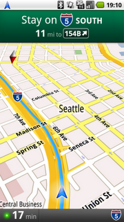

[http://googleblog.blogspot.com/2009/10/announcing-google-maps-navigation-for.html (영문)](http://googleblog.blogspot.com/2009/10/announcing-google-maps-navigation-for.html "[http://googleblog.blogspot.com/2009/10/announcing-google-maps-navigation-for.html]로 이동합니다.")
[http://www.zdnet.co.kr/Contents/2009/10/29/zdnet20091029171151.htm (한글)](http://www.zdnet.co.kr/Contents/2009/10/29/zdnet20091029171151.htm "[http://www.zdnet.co.kr/Contents/2009/10/29/zdnet20091029171151.htm]로 이동합니다.")
구글이 오랜만에 사용자를 위한 사고를 쳤습니다. 무려 '무료 네비게이션 프로그램' 입니다. 안드로이드 2.0 에서 동작한다고 합니다.
 구글이 안드로이드를 많이 밀고 있긴 했지만, 이 것만큼 파급력이 큰 것도 없으리라 생각합니다. 저도 결혼하면서 네비게이션을 살까 생각을 했었는데, 이 기사를 보고, 무조건 국내에서 안드로이드폰이 나오기만을 기다려야겠습니다.
 당연히 관련 업계는 비상이 걸렸는데, 어떻게 시장이 변화될지 궁금합니다.

