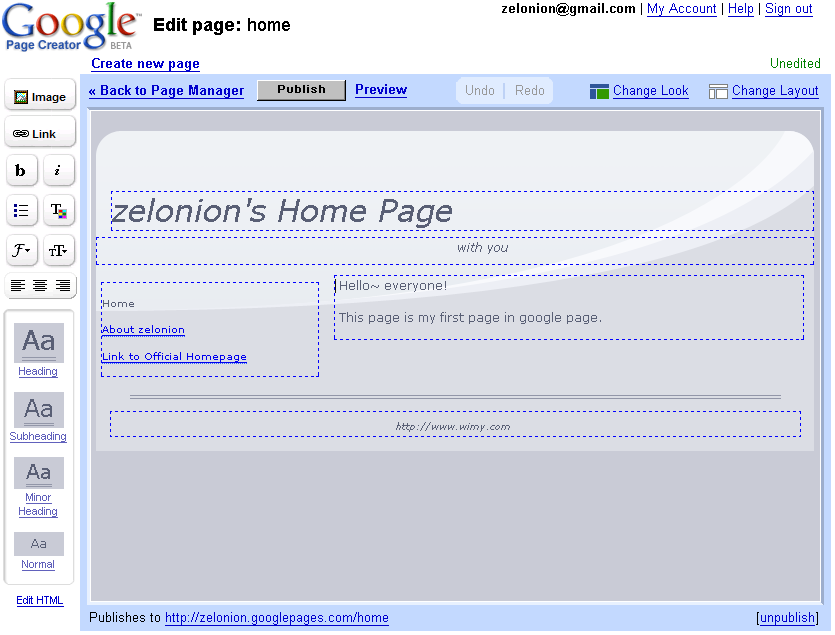
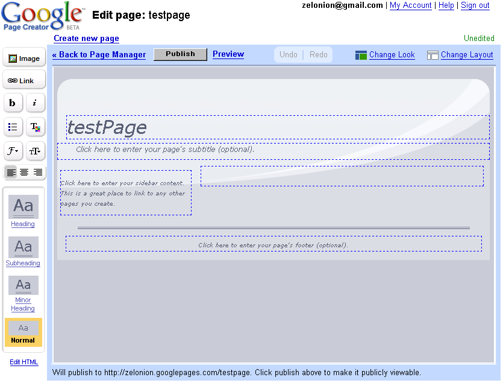
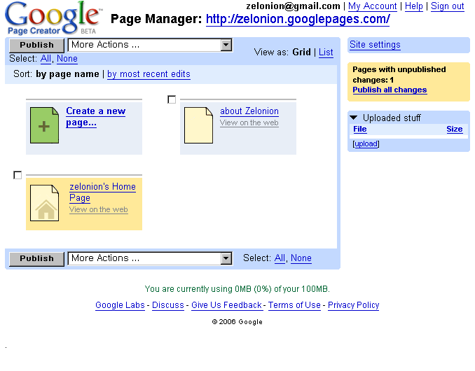
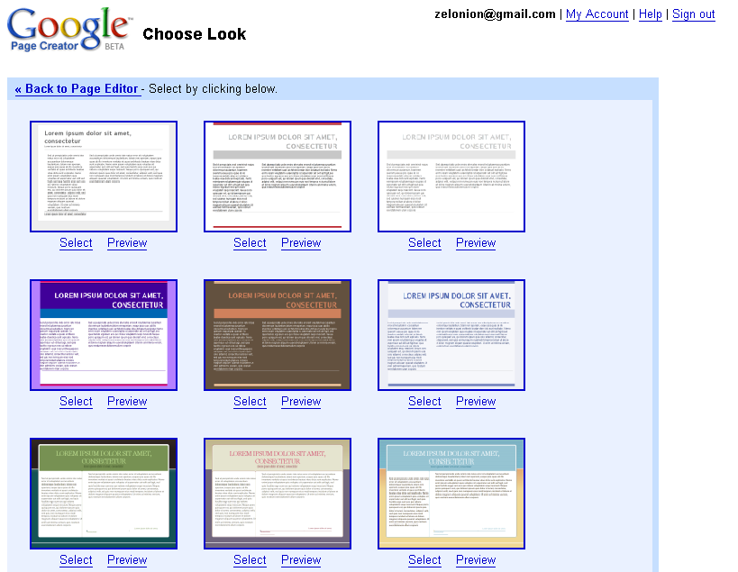
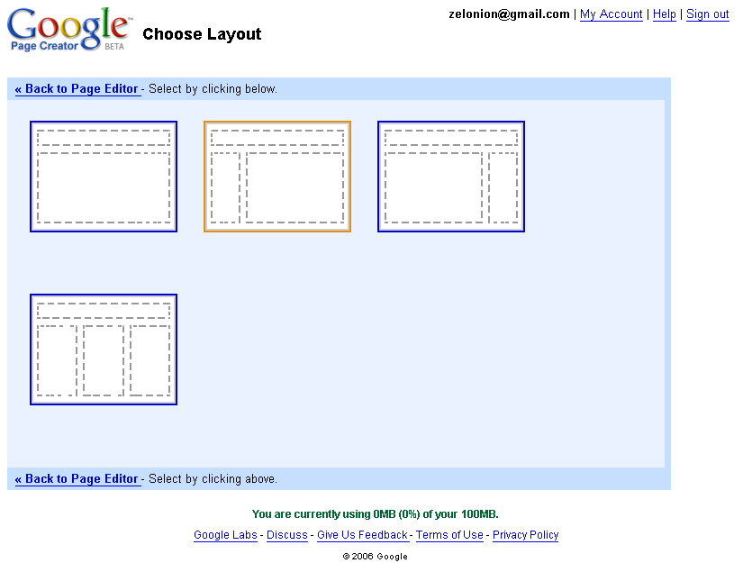
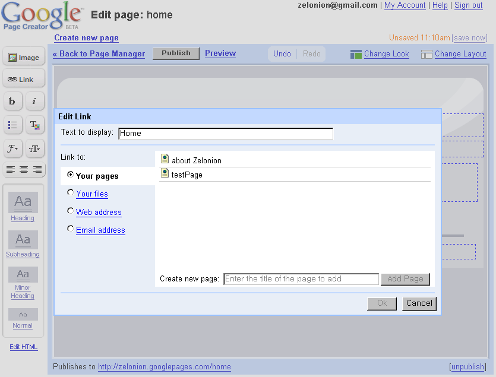

http://pages.google.com 에서 구글 페이지 베타 테스터에 당첨(?) 되어서 구글 페이지를 잠깐 써보았다.
아직 베타라서 그런지 그렇게 많은 기능을 가지고 있는 것은 아니고 html 에 대해 잘 모르는 유저들이 간단히 자기 자신의 페이지를 만들 수 있는 정도의 느낌이다. 물론 기존에 우리나라에서 많이 제작된 홈페이지 위자드처럼 스킨 형태를 바꾼다던지, 색깔을 바꾼다던지 정도가 눈에 띄인다. 그리고 역시 구글답게 FCKEditor 만큼의 에디터를 만들어서 쉽게 글꼴을 바꾼다던지 크기를 변경한다던지 할 수 있는 기능이 보인다.
\* 웹페이지 에디터의 웹 2.0 방식이랄까?
\* 구글 페이지에서 만든 링크를 쉽게 걸 수 있게 한다.
\* 구글 페이지에 올린 이미지를 쉽게 보여줄 수 있다.
\* 1메가 정도의 이미지를 올리는데 시간이 꽤 걸렸다(아무래도 외국이라서 그런듯)
\* 전체적으로 웹 2.0 을 활용하여 유저가 쉽게 자신의 페이지를 꾸밀 수 있도록 만들어 놓았다.
- 기본 메뉴. 내가 만든 페이지들을 볼 수 있고, 새로운 페이지를 만들 수 있게 한다.

-. 새로운 페이지를 만들면 페이지를 꾸밀 수 있는 화면으로 간다.

-. 테스트로 만들어본 페이지

-. 링크를 걸 때는 다양한 방법을 다 지원한다. 특히 자신이 만든 페이지로의 링크가 눈에 띄인다.

-. 레이아웃 변경. 레이아웃의 종류는 그렇게 많지 않지만 일반적으로 많이 쓰이는 것이 준비되어 있다.

-. 외양(look) 변경. 꽤 많이 준비되어 있다.

